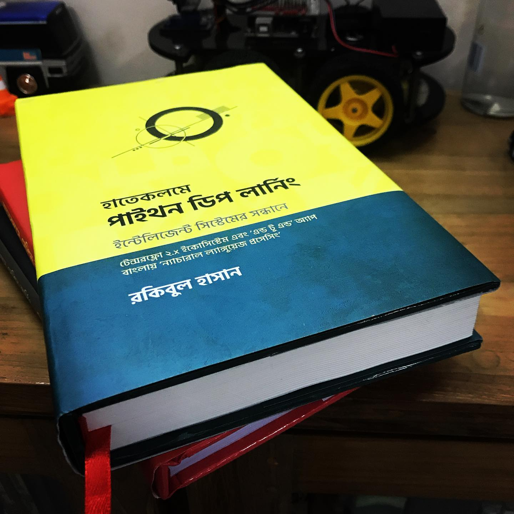

সবকিছুর পেছনের দর্শনটা জানলে অনেককিছুই বোঝা সহজ হয়।

আমরা যাকে মেশিন লার্নিং বলি, সেটার একটু স্পেশালাইজড ভাগ হচ্ছে এই ডিপ লার্নিং। সবই মেশিন লার্নিং তবে মানুষের চিন্তা করার প্রসেস, মাথার নিউরাল নেটওয়ার্ক যেভাবে কাজ করে সেটার একটা সিমপ্লিফাইড ভার্সন হচ্ছে এই ডিপ লার্নিং। ভয় পাবেন না। ব্যাপারটাকে আরেকটু খোলাসা করছি।
{: .notice-info}

ধরা যাক আমরা মিউজিয়ামে বিশাল একটা কমপ্লেক্স ছবির সামনে দাড়িয়ে আছি। ছবিটার আগামাথা না পেয়ে একটু পেছনে গিয়ে দাড়ালাম। ওমা, আস্তে আস্তে জট খোলা শুরু করলো। আচ্ছা, ওটা  তো পা, তাই না? এখন মনে হচ্ছে একটা মানুষ পতাকা ধরে আছে। তার পেছনে একটা পশুর আকৃতির মতো বোঝা যাচ্ছে। মানে, একটা ‘অ্যাবস্ট্রাক্ট’ ছবি বোঝা শুরু করলাম। কিভাবে? ভেতরের ‘প্যাটার্ন’ উদ্ধার করে। 

স্পেন মিউজিয়ামের শহর। ছবি দেখতে গিয়ে মাথা খারাপ হবার যোগাড়। শেষে এই ব্যবস্থা। স্টেপিং ব্যাক।

আর সেটাই বা কিভাবে সম্ভব? বলছি।

ডিপ লার্নিং এর একটা শুরুর কনসেপ্ট হচ্ছে ‘অ্যাবস্ট্রাকশন’, জটিল বিষয়কে সহজভাবে বুঝতে ধাপে ধাপে, ‘লেয়ার বাই লেয়ার’ কিভাবে সমাধান করা যায়। ওই কমপ্লেক্স ছবি বোঝার মতো। ধরুন, যন্ত্রকে অনেকগুলো মানুষের মাথার ছবি দেয়া হলো। বলা হলো - আপনার বন্ধুবান্ধবের ছবিগুলো থেকে আপনাকে আলাদা করতে। যন্ত্রতো মানুষের মতো অতো বুদ্ধিমান না, কি করবে সে? হাটিহাটি পা পা করে?
{: .notice-info}

একটা সম্ভাব্য উপায় হতে পারে এরকম: (১) প্রথমে ছবিতে গোল মাথাটা আগে বের করার চেষ্টা করবে, (২) এরপর ছবির পিক্সেলের ‘ইনটেনসিটি’ বুঝে মুখের বিভিন্ন ফিচার, যেমন চোখ, নাক, চিবুক, ভুরু, ইত্যাদিকে বিভিন্ন ভাগে ফেলবে, (৩) এরপর - চোখের একটা 'কোনা'কে আলাদা করে ফেলবে সে। অথবা নাকের একটা অংশ।

এর মানে কী? মানে ওই কমপ্লেক্স ছবি বোঝার মতো করে, একটা একটা করে ফিচার আমরা ‘অ্যাবস্ট্রাক্ট’ করার চেষ্টা করেছি। কিভাবে? একেকটা লেয়ারে। মানে, প্রথম লেয়ারে মাথার গোলাকার অংশ, পরের লেয়ারে চোখ, নাক, চিবুক এর কোনা। এই অংশগুলোকে যখন জোড়া লাগাবে তখন পরের কয়েকটা লেয়ারে একটা পুরো চোখ অথবা নাক সে বুঝতে পারবে। চোখ, নাক, কপাল, চিবুক এইসব ঠিকমত বুঝতে পারলে পরের কয়েকটা লেয়ারে পুরো মুখমণ্ডল সে বুঝতে পারার কথা। 

বেশি গুলিয়ে ফেলেছি? না? হ্যাঁ?

একটা ছবি দেখা যায়। 'আ পিকচার ওর্থ থাউজ্যান্ড ওয়ার্ডস'।
<figure>
	
	
  <figcaption>একটা একটা করে ফিচার আমরা ‘অ্যাবস্ট্রাক্ট’ করার চেষ্টা</figcaption>
</figure>
যদি ‘না’ হয়, তাহলে বলবো এই একই কাজ করে মানুষের মাথার নিউরাল নেটওয়ার্ক। লেয়ার ধরে। মানুষ এপর্যন্ত যাই আবিস্কার করেছে, তার সবকিছুই সে ধারণা নিয়েছে প্রকৃতি থেকে। বিমান, সাবমেরিন, এসেছে পাখি, আর মাছের ধারণা থেকে। মেশিন কিভাবে শিখবে সেটার ধারণা নিয়েছে ‘মানুষ কিভাবে শেখে’। একই কনসেপ্ট। একেক ক্লাস একেক লেয়ার। হটাৎ করে তো আমরা শিখিনি। শিখেছি লেয়ার ধরে - একেকটা ক্লাস পাড়ি দিয়ে। বয়সের সাথে।

সেরকমভাবে মাথার নিউরালের মতো ডিপ লার্নিং মডেল একেকটা লেয়ার থেকে যত বেশি সামনের লেয়ারে এগোবে - ততই সে কমপ্লেক্স ফিচারগুলোকে ঠিকমতো আইডেন্টিফাই করতে পারবে। এটা সে করতে পারে যেহেতু সে আগের লেয়ারে নিচের ফিচারগুলোকে একসাথে 'এগ্রিগেট' এবং 'কম্বাইন' করে যোগ করতে পারছে ফিচারগুলোকে। এই একই কাজ করবে ‘অটোনমাস’ গাড়ি রাস্তায় নেমে। রাস্তার ‘এজ’, শেষ অংশ বা স্পিডলিমিট, ট্রাফিক লাইট ধরে ধরে বুঝতে পারবে। 

তাহলে কী বোঝা গেল?

প্রথম লেয়ার হচ্ছে ইনপুট লেয়ার। ছবির সব পিক্সেল যাবে এখানে। আপনার পুরো মুখমন্ডল বুঝে যাবে শেষ লেয়ারে - মানে যেখানে সে বলবে এই ছবিতে আপনি। এটা শেষ লেয়ার, অর্থাৎ আউটপুট লেয়ার। মাঝখানে আপনার চোখ, কান, নাক বুঝে গেল যারা, তারা হিডেন লেয়ার। সেই লেয়ার অনেকগুলো হতে পারে সমস্যার কমপ্লেক্সিটির ওপর ভিত্তি করে।

এখন আপনি শেখাতে পারবেন আমাকে। এখন বলুন এই যে বিভিন্ন লেয়ারে একেকটা কাজ হলো - চোখ, নাক, চিবুক এর কোনা চিনে চিনে জিনিস আলাদা করা, এটাকে ডিপ লার্নিং এর ভাষায় কী বলে? বিশেষ করে ফিচারকে আলাদা করার এই কনসেপ্ট? 

একজাক্টলি! ‘ফিচার এক্সট্র্যাকশন’। এই যে বিভিন্ন লেয়ারে একেকটা ফিচার মানে চোখ, কান, নাক ধরে ধরে ‘আইডেন্টিফাই’ করার এই আইডিয়াটার জন্য ডিপ লার্নিং! এটুকু বুঝলেই ‘ডিপ লার্নিং’ বোঝা অর্ধেক শেষ। সাধারণ মেশিন লার্নিংয়ে ফিচার এক্সট্র্যাক্ট’ করি আলাদাভাবে ‘ফিচার ইঞ্জিনিয়ারিং’ দিয়ে। ডিপ লার্নিংয়ে এই ‘ফিচার এক্সট্র্যাকশন’ ব্যাপারটা কিছুটা অটোমেটিক। তাই বললে সবসময় যে ডিপ লার্নিং ভালো সেটাও নয়। মেশিন লার্নিং না বুঝে ডিপ লার্নিং বুঝতে গেলে পুরো জিনিসটাই ব্ল্যাক বক্স মনে হবে। ডিপ লার্নিং এর একটা অসাধারণ কনসেপ্ট হচ্ছে ব্যাক-প্রপাগেশন। আমাদের মডেলের ট্রেনিংএর সময় ভুলগুলোকে কমিয়ে আনতে এই জিনিসটার ধারণা এসেছিলো সেই ১৯৬০ সালে।
{: .notice}

ইতিহাস? আমরা প্রস্তর যুগের মানুষ বলে জানতে হয় অনেক ইতিহাস। সেটাও কাভার করছি সামনে। আমরা ভুল কমাই কিভাবে? বাচ্চারা একবার আগুনে হাত দিয়ে বোঝে, আর জীবনে যাওয়া যাবে না ওখানে। এটাই ‘এরর কারেকশন’। ডিপ লার্নিং এর ভাষায় ব্যাক-প্রপাগেশন।

আমার বিগ ডেটা (মিলিয়ন মিলিয়ন ডেটা রেকর্ড) নিয়ে কাজের ধারণা আসে ২০০৮-৯ সালের দিকে। সব মোবাইল, ল্যান্ডলাইন ফোনের মিনিট প্রতি চার্জের সাথে একেকটা অপারেটরের আন্তসংযোগ এর হিসেব এবং তার প্রজেকশন করতে গিয়ে। ডেটা যে কথা বলে সেটা বুঝতে পেছনে ফিরে তাকাতে হয়নি আর। ডেটা মিথ্যা বলে না। তখন কাজ করতাম স্টাটিসটিক্যাল প্যাকেজ নিয়ে। এখন সেটাকে আমরা রং চং লাগিয়ে বলছি মেশিন লার্নিং। একই জিনিস।

মার্কিন যুক্তরাস্ট্রে কয়েকটা মেশিন/ডিপ লার্নিং বুটক্যাম্পে যেয়ে বুঝলাম একটা সত্য কথা। দরকার কমনসেন্স। পাশাপাশি ক্রিটিক্যাল  থিঙ্কিং। নিজস্ব ডোমেইনে। যেমন হেলথকেয়ার প্রফেশনাল তার ডোমেইনে ভালো ডেটা সায়েন্টিস্ট হবে, এটাই সত্য। প্রোগ্রামিং সবাই পারে, কিন্তু ডেটার ভেতরের বায়াস, তার ফ্রিকোয়েন্সি, কি কি অ্যানামলি আছে - সেটা বুঝতে পড়ে থাকতে হবে ডেটা নিয়ে। ভালবাসতে হবে ডেটাকে, পরিবারের সদস্যদের মতো করে। সবার বকাবকি শুনেও।

আমরা যতোই এই ডিপ লার্নিং নিয়ে এখন লাফালাফি করি না কেন এই কনসেপ্ট অনেক অনেক পুরানো। ‘আরবের লোকেরা যখন মারামারি করতো’ সেই সময়ের না হলেও বেশ পুরানো। ডিপ লার্নিং এর ইতিহাস জানতে ফিরে যাব সেই ১৯৪৩ সালে, দুজন বিজ্ঞানী একটা কম্পিউটার মডেল তৈরি করেছিলেন মানুষের মাথার নিউরাল নেটওয়ার্ককে ভিত্তি করে। 

তারপরে কিছু কাজ হলেও সেটা তেমন সাফল্যের মুখ দেখেনি কয়েকটা কারণে। একটা ‘এআই উইন্টার’। মানে কিছুটা ডটকম বাবলের মতো। অনেক আশা নিয়ে প্রচুর ইনভেস্টমেন্ট এর পরও কাজ দেখাতে পারেনি এই জিনিস। আমরা যেহেতু প্রস্তর যুগের মানুষ, আমাদেরকে দেখতে হয়েছে অনেক কিছু। এরপর এসেছিলো দ্বিতীয় এআই উইন্টার। শেষ রক্ষা হয়নি।

তবে, এবারের ঘটনা ভিন্ন। একটা উদাহরণ দেই। বাংলা আমাদের ভাষা হলেও গুগল ভয়েস এপিআই (তার একটা প্রোডাক্ট জিবোর্ড, গুগল কীবোর্ড) ‘টেক্সট টু স্পীচে’ যে অ্যাক্যুরেসি দেখাচ্ছে সেটা সম্ভব হয়েছে সেই একই কারণে। অনেক অনেক ডেটা আছে গুগলের কাছে। মানে কোটি কোটি ভয়েস স্যাম্পল। আর পাশাপাশি আমরা ঠিক করে দিয়েছি যখন সে ভুল টাইপ করেছে। মোদ্দা কথা একটাই। একসাথে কোটি কোটি ডেটা হ্যান্ডেল করার সক্ষমতা। কিভাবে সম্ভব হলো?

আগেই বলেছি, (১) কোটি কোটি ডেটা। (২) সেগুলোকে একসাথে হ্যান্ডেল করার সক্ষমতা। কারণ - বেড়েছে প্রসেসিং স্পিড। আমাদের হাতের মোবাইলই তো চাঁদে ল্যান্ড করা অ্যাপোলো গাইডেন্স কম্পিউটার থেকে হাজার গুন ফাস্ট! পাশাপাশি কমেছে স্টোরেজের দাম। আপনার হার্ডডিস্কের কথাই ধরুন। বেড়েছে মেমরির সক্ষমতা। ডিপ লার্নিং না হয়ে যাবে কোথায়? আর গেমারদের ‘জিপিইউ’ (গ্রাফিক্স প্রসেসিং ইউনিট) হাইজ্যাক করে নিয়েছি আমরা। ওমা, শুধু তোমরাই খেলবে, আমরা খেলবো না? এই জিপিইউ এখন আমাদের হাতিয়ার - দ্রুতগতির ট্রেনিং এর জন্য। 

ডিপ লার্নিং এর একটা বড় অংশ হচ্ছে ইমেজ, মানে ভিজ্যুয়াল - যন্ত্রকে দেখে চিনতে হবে। মানুষের জন্য চোখ এবং মাথার কোঅর্ডিনেশন যেমন, সেরকম সেই ছবিকে ঠিকমতো চিনতে ১৯৭৯ সালে জাপানিজ এক ভদ্রলোক একটা টেকনিক নিয়ে আসেন যেটাকে আজকে আমরা বলি ‘কন্ভল্যুশনাল নিউরাল নেটওয়ার্ক’ (সিএনএন)। নিউরাল নেটওয়ার্কের মধ্যে এই অপটিমাইজেশন দেখলে মাথা খারাপ হবে আপনার। যারা ডিপ লার্নিং শিখবেন - তারা এই ‘সিএনএন’ ছাড়া আগাতে পারবেন না।

এখন আসি, আসল কথায় - কিভাবে শিখবেন ডিপ লার্নিং?
{: .notice}

আসল কথা বলব, না ‘সুগারকোট’ করব? ভেবে বলুন।

আসল কথা - আমি যেভাবে এই মুহুর্তে শিখতে চাইতাম - সেটা বললে মন খারাপ হতে পারে। আমি শর্টকাট বলতে পারি - কিন্তু সেটা লংটার্মে কারো ভালো হবে না। মন খারাপ হলেও আমি বলছি - মেশিন লার্নিং না শিখে ডিপ লার্নিংএ যাওয়াটা অনেকটাই আত্মঘাতী। ইংরেজি গ্রামার ছাড়া ইংরেজি বলতে পারবেন - তবে সেটা কেমন শোনাবে সেটা আপনারা ভালো জানেন।

তাহলে কি ঠিক হলো? নো ‘ডিপ লার্নিং’ উইথআউট বেসিক ‘মেশিন লার্নিং’। এটা না মানলে বাকিটা পড়ার দরকার নেই। 

এখন আসি সমস্যার জায়গায়।

ধরে নিচ্ছি - পৃথিবীতে দু ধরনের মানুষ আছে। (১) নন-প্রোগ্রামার, (২) প্রোগ্রামার।
{: .notice}

নন প্রোগ্রামারদের রুটটা সোজা। মানে তাদের শেখানো সোজা। 

কেন বললেন এই কথা? আপনার প্রশ্ন। কারণ তাদের ‘প্রেজুডিস’ থাকে না - মানে ‘আমি এটা জানি ওটা জানি’। ফলে তারা মনোযোগী হন না পুরো সময় ধরে। ফলে মিস করেন অনেক কানেক্টিং লিংক। এটা অনেক ইম্পর্টেন্ট। তবে ‘আসল’ ভালো প্রোগ্রামাররা সারাজীবন ওপেন মাইন্ডেড থাকেন নতুন কিছু শিখতে।

যারা নন-প্রোগ্রামার,  তাদের মধ্যে বেশিরভাগ আসেন এই মনোভাব নিয়ে ‘আমি তো কিছুই জানি না’, আমাকে শিখতে হবে। ‘রেইন অর শাইন’। এটা তাদের জন্য জীবন মরণ সমস্যা। তাই তারা অনেকটাই ওপেন মাইন্ডেড। তারা জানেন, এই জিনিস শিখতে আমার যা যা শেখার দরকার সেটা শিখতেই হবে। 

আপনি কি জানেন মাইক্রোসফট এক্সেল দিয়েও ‘মেশিন লার্নিং’ শেখা সম্ভব? এই মুহূর্তে পৃথিবীতে যে কয়েকটি এনভায়রমেন্ট নিয়ে মেশিন লার্নিং এ কাজ হয়, তার মধ্যে ‘আর’ এনভায়রনমেন্ট দিয়ে শেখা সোজা। লার্নিং কার্ভ সেরকম ‘ষ্টিপ’ নয়। শুরুটা একদম সোজা। স্ট্যাটিসটিক্স এনভায়রমেন্ট থেকে এসেছে এই “আর” প্রোগ্রামিং এনভায়রমেন্ট। এর অর্থ হচ্ছে ডেটাকে ঘিরে তৈরি তৈরি হয়েছিল এই “আর” প্যাকেজ। একদম শুরু থেকে। আমি ‘এসপিএসএস’ও ব্যবহার করেছি - তবে ‘আর’ হচ্ছে সবকিছুর বেসিক। 

আমাকে প্রশ্ন করলে বলবো, “আর” দিয়ে মেশিন লার্নিং শেখা অনেক সহজ। বিশেষ করে শুরুর দিকে। ডেটার ভেতরের পার্সপেক্টিভ পেতে সুবিধা হয়। পাশাপাশি ‘পাইথন’ ইউনিভার্সাল প্রোগ্রামিং ল্যাঙ্গুয়েজ হিসেবে মেশিন লার্নিং এ ব্যবহার হচ্ছে। ডেটাকে ঘুরিয়ে ফিরিয়ে দেখতে ‘আর’ এর একটা কমান্ড সেই কাজটা করে দিতে পারে সেটা পাইথনে লাগবে কমবেশি ৫ লাইনের কোড। 

তবে, প্রোগ্রামিং এনভায়রনমেন্ট নিয়ে বেশি বলবো না। কারণ এটার সাথে পার্সোনাল প্রেফারেন্স কানেক্টেড। যার যেখানে সুবিধা, তাতে সমস্যা নেই। কথা হচ্ছে, যারা প্রোগ্রামিং জানেন না, তাদের জন্য ‘মেশিন লার্নিং’ শেখা বরং সহজ। অনেক কিছু ‘আন-লার্ন’ করতে হবে না। প্রথাগত প্রোগ্রামিং এর সীমাবদ্ধতা কথা চিন্তা করেই এসেছে মেশিন/ডিপ লার্নিং। প্রোগ্রামিং হচ্ছে একটা রুলসেটের উপর ভিত্তি করে। মেশিন লার্নিং এর উল্টো। ডেটা বলে দেবে কি রুল হবে - যা পাল্টাবে ডেটার উপর ভিত্তি করে। 

অনেক হলো। আর বক বক করবো না।

তবে শুরুতে প্রোগ্রামিং এনভারমেন্ট নিয়ে মাথা না ঘামানোই ভালো। মেশিন লার্নিং এর পেছনের দর্শন জানলে শেখা খুব সহজ হয়। আপনি জানেন কোথা থেকে কোথায় যেতে হবে। এবং এখন কোথায় আছেন। যেহেতু আমার মেশিন লার্নিং বন্ধুরা আছেন পৃথিবী জুড়ে, তারা বলেন একটা কথা। যদি শিখতে চাও - মেশিন লার্নিং, তাহলে শুরু করো ‘প্রজেক্ট টাইটানিক’ দিয়ে। ‘দিস ইস দ্য গেটওয়ে টু মেশিন লার্নিং’। পিরিয়ড। আপনি যদি সমস্যাটা ঠিকমতো বুঝতে পারেন তাহলে সমাধান হাতের কাছেই।
{: .notice-info}

কেন? তাহলে গল্পটা বলতে হবে। আছে তো সময়? আর দুই মিনিট। শেষ করে দিচ্ছি!

কাহিনীর সাল ১৯১২। সত্যি ঘটনা। ধন্যবাদ দিতে হয় জেমস ক্যামেরনকে। উনি আমাকে বাঁচিয়েছেন নতুন করে গল্পটা ফাঁদতে। এই ‘আন-সিঙ্কেবল’ মানে ‘ডুববার নয়’ আরএমএস টাইটানিক’ ডুবে যায় আটলান্টিক পাড়ি দেবার সময়। একদম প্রথম যাত্রায়। আইসবার্গে ধাক্কা লেগে। তখন রাত ১১:৪০। ধারণা করতে পারি - ২২২৪ জন যাত্রী আর ক্রু’র মধ্যে প্রায় সবাই ঘুমাতে গিয়েছিলেন নিজ নিজ কেবিন অথবা বাঙ্কারে। পরের ঘটনা সবার জানা।

১৫০২ জন মারা যান ওই যাত্রায়।

এই সত্যি ঘটনাকে ঘিরে তৈরি করা হয়েছে এই কালজয়ী সমস্যা। এখানে আমাদেরকে দেয়া হয়েছে দুটো ডেটাসেট। একটাতে দেয়া হয়েছে ৮৯১জন মানুষের সম্পর্কে ১২টা ফিল্ড। সেখানে একটা ফিল্ড আছে যার মধ্যে বলা আছে উনি বেঁচে গিয়েছিলেন না মারা গিয়েছিলেন ওই যাত্রায়। খেয়াল করুন ব্যাপারটা। সত্যিকারের ডেটাসেট। ইন্টারনেটে আছে সবার নাম। দেয়া আছে তাদের ভাগ্য। বানানোর কিছু নেই এখানে।

এখন আসুন সমস্যাতে। আরেকটা ডেটাসেট দেয়া হয়েছে যার মধ্যে মানুষগুলোও নতুন। ওই ৮৯১ জনের বাইরের মানুষ উনারা। উনাদের ভাগ্য বের করবো আমরা। ৪১৮ জন প্যাসেন্জারের। সারিও ৪১৮টা। ওখানে সব ফিল্ড আছে ওই একটা ফিল্ড ছাড়া। যেটাতে বলা আছে উনি বেচেঁ অথবা মারা গিয়েছিলেন। আমরা জানি না তাদের ভাগ্যে কি ঘটেছিল। 

তো, টাইটানিক চ্যালেঞ্জটা কী?
{: .notice}

ওই ৪১৮জন মানুষের ডাটাসেট থেকে প্রেডিক্ট করে বের করতে হবে কারা বেঁচে অথবা মারা গিয়েছিলেন। আমি যখন প্রথম প্রথম এটা নিয়ে কাজ শুরু করি - তখন অবাকই হয়েছিলাম। এটা কিভাবে সম্ভব? আমি কিভাবে জানবো? মানুষের মৃত্যু প্রেডিক্ট করা আমাদের কম্ম নয়। আর মেশিন লার্নিংই বা কিভাবে পারবে?

আমি কথা দিতে পারি একটা। আপনারা যদি এই মেশিন লার্নিং সমস্যাটা সলভ করতে পারেন, তাহলে ডিপ লার্নিং আপনাদের জন্য পানিভাত। সত্যি বলছি। আমার বয়স ৫০। একটা জিনিস বলতে পারি। যেকোন সমস্যার ভেতরে তার সমাধান লুকিয়ে থাকে। তাই সমস্যাটা বোঝা জরুরি। বিশেষ করে এটার হিউম্যান এলিমেন্ট। ফিচার ইঞ্জিনিয়ারিং। বেশি বলে আকর্ষণ নষ্ট করতে চাই না।
{: .notice-info}

আরেকটা জিনিস।

‘স্টার্টিং ইজ হাফ দ্য ব্যাটেল’।

শুরু করছেন কখন?

এবং কোথায়?

চোখ রাখুন [এখানে](https://rakibul-hassan.gitbook.io/mlbook-titanic/)।

## বাংলায় ডিপ লার্নিংয়ের একমাত্র বই

	পাইথন প্রোগ্রামিং
	পাইথন ডিপ লার্নিং
	ন্যাচারাল ল্যাঙ্গুয়েজ প্রসেসিং

পাবেন [এখানে](https://www.rokomari.com/book/198757/)।