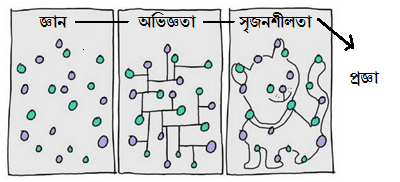

আমার জীবনের বিশাল একটা সময় গিয়েছে 'ডেটা'কে প্লট করতে। 'ডেটা' থেকে প্রজ্ঞা বের করতে। প্রচুর ডেটা যুক্ত করেছি এবং করছি সরকারি নীতিনির্ধারণী প্রসেসগুলোতে। আর তখনি হয়েছে অসাধারণ সব অভিজ্ঞতা, এই ডেটা নিয়ে। ডেটাকে কিভাবে নীতিমালাগুলোতে মানুষের মঙ্গলে ব্যবহার করা যায় তা দেখেছি নিজের চোখে।

'এনলাইটেনড ইকোনমিক'গুলো অনেক আগেই ডেটাকে 'স্ট্র্যাটেজিক অ্যাসেট' হিসেবে চিহ্নিত করেছেন অন্যদের থেকে এগিয়ে থাকতে। 'স্ট্র্যাটেজিক অ্যাসেট' - যাকে বাংলায় বলা যেতে পারে 'কৌশলগত সম্পত্তি'। কোন কিছুর উৎকর্ষে পৌঁছাতে দরকার যেই 'সফট' জিনিস। আমাদের প্রচুর ডেটা আছে, তবে সেই ডেটা থেকে 'প্রজ্ঞা' অথবা 'ইনসাইট' বের করার জন্য জনবল সেভাবে তৈরি হয়নি। সেটার প্রথম ধাপ হিসেবে এই সাইটটা। ইঞ্জিনিয়ারিংয়ের প্রথম ধাপ হচ্ছে শেখা - কিভাবে পয়েন্ট 'ক' থেকে 'খ'তে যাওয়া যায়। আমার শেখানোর 'কনসেপ্ট' কিছুটা ভিন্ন। আমি চাই - ওই রাস্তায় পথ হারিয়ে আপনি পৌঁছান পয়েন্ট 'গ'তে। সেখানেই আমার স্বার্থকতা।
{: .notice}
আমার ব্যাপারে কিছুটা ধারণা পাবেন [এখানে](https://raqueeb.wordpress.com/)। বাকিটা পাবেন [এখানে](https://www.linkedin.com/in/raqueeb/) এবং [এখানে](https://www.facebook.com/raqueeb)। 



বয়স পঞ্চাশ। 'কানেক্টিং দ্য ডটস' থেকে অনেক শিখেছি আমি। সৃষ্টিকর্তা অনেক দিয়েছেন আমাকে। নিয়েছেন অনেক বড় বড় প্ল্যাটফর্মে। দেশও কম দেয়নি আমাকে। শুরু সেই ৭ম শ্রেণী থেকে। সেটা থেকে ফেরৎ দিতে চাই নতুন প্রজন্মকে। জ্ঞান থেকে প্রজ্ঞা দিয়ে।
{: .notice-info}

২০১৪ সালের লেখা। ৪ সেপ্টেম্বর। তুলে দিলাম ব্লগ থেকে।

## পৃথিবী চষে বেড়ানো

১. সমস্যাটার শুরু প্রায় এক দশক আগে। ছুটাছুটির চাকরি। আজ এখানে তো কাল ওখানে। শেষমেষ ‘পীস কীপার’ হিসেবে পোস্টিং হলো কঙ্গোতে। ঘুরাঘুরিই বেশি। ঘুমের সময় ছাড়া বাকিটা হিসেব করলে – পুরোটাই রাস্তায়। নিজ দ্বায়িত্বের এলাকা, যাকে বলে ‘এরিয়া অফ রেস্পন্সিবিলিটি’ – ইঞ্চি ইঞ্চি করে না জানলে বিপদ। মানুষের জীবন বলে কথা। পুরো এলাকা থাকতে হবে নিজের নখদর্পণে। কন্সট্যান্ট ভিজিল্যান্স। পায়ে হাটা অথবা গাড়ি – পায়ের মাইলোমিটারে লাখ মাইল পার হয়েছে নিশ্চিত।

## চিন্তাগুলোকে প্লটিং 

২. রাস্তায় নামলেই হাজার চিন্তা কিলবিল করে মাথায়। একটা এদিকে হলে আরেকটা ওদিকে। মাথা মুন্ডু ছাড়া চিন্তাভাবনা। দিন কয়েক পর বেস ক্যাম্পে ফিরলে বসতাম ইউএন এর কচ্ছপ গতির ইন্টারনেট নিয়ে। সভ্যতার সাথে একমাত্র ‘ব্যাকওয়ার্ড লিংকেজ’ – ওই স্যাটেলাইট লিংক। একসময়, প্লট করতে শুরু করলাম চিন্তাগুলোকে। ‘চ্যানেলাইজ’ করতে তো হবে কোথাও। একেকটা চিন্তা একেকটা ডট। কানেক্টিং দ্য ডট’স ব্যাপারটা বুঝলাম অনেক পরে। চল্লিশের আগে নাকি ব্যাপারটা আসে না মাথায়?

## পৃথিবীর সবচেয়ে বড় টেলিকম্যুনিকেশন ট্রেনিং ফ্যাসিলিটি

৩. আগের ঘটনা আরো চমত্প্রদ। কঙ্গোতে যাবার ঠিক আগ মূহুর্তে ফিরেছিলাম মার্কিন যুক্তরাষ্ট্রের সিগন্যাল স্কুল থেকে। থাকতে হয়েছিল লম্বা সময়ের জন্য। প্রায় নব্বই বর্গ মাইলের পৃথিবীর সবচেয়ে বড় টেলিকম্যুনিকেশন ট্রেনিং ফ্যাসিলিটি। যায়গাটাও জর্জিয়ার একটা অজ পাঁড়া গাঁয়ে। সন্ধার পর কুপি জ্বলার মতো অবস্থা। স্কূল থেকে ফিরে কাজ না পেয়ে হাত দিলাম রান্নায়। কাঁহাতক আর খাওয়া যায় ফাস্ট ফুড! পিএক্স থেকে এটা কিনি, ওটা কিনি। বাসায় এসে ভয়াবহ ধরনের ‘টেস্ট এণ্ড ট্রায়াল’। অসুবিধা কি? গিনীপিগ তো নিজে। ক্ষান্ত দিলাম স্মোক ডিটেক্টরের পানির ঝাপটা খেয়ে। বার কয়েক। তবে, একেবারে ক্ষান্ত নয়, কমিয়ে দিলাম গতি। মনোযোগ সরালাম নতুন দিকে।

## লেখার প্রেরণা, লিখতে হবে ১০ লক্ষ শব্দ

৪. বিশাল লাইব্রেরী। এটা ওটা ইস্যু করি, টাইম লিমিটও অসহনীয় লম্বা। পুরনো পত্রিকা, দুস্প্রাপ্য বই সব মাইক্রোফিশে। একদম নতুন বই লাইব্রেরীতে না থাকলেও সেটা কিনে এনে চেকআউট করিয়ে রাখতেন লাইব্রেরিয়ান। আমাজনের বেস্টসেলার লিস্ট দেখা অভ্যাসে পরিনত হয়ে গেলো ওই সময়ে। অবাক হয়ে লক্ষ্য করলাম ‘বেস্টসেলার’গুলো লিখছেন আপনার আমার মতো সাধারণ মানুষ। মানে, পেশাদার লেখক নন তারা। সাহস পেলাম। যাই লিখি, পাঠক পেতেই হবে বলেছে কে? মনের খোরাক মেটানোর জন্য লেখা। ওই বিরানব্বই থেকে। সেথ গোডিংয়ের গলা শুনি প্রায়ই। শিপ, বাডি! শিপ! লিখেছি লক্ষ লক্ষ শব্দ। এখন কানেক্ট করতে পারছি অনেক কিছুই।

## স্ট্যান্ডিং অন দ্য শোল্ডার'স অফ জায়ান্ট

৫. দেখা গেলো ওই ‘বেস্টসেলার’দের কেউ ছিলেন স্টক এক্সচেঞ্জের হর্তাকর্তা, কেউ সিআইয়ের চীফ। ইনভেস্টমেন্ট ব্যাংকার। সরকারী কর্মকর্তা। নেভী সীল। ফুটবল কোচ। জিমন্যাষ্ট। তারা লিখছেন পেছনের অনেকগুলো বছরের অভিজ্ঞতা নিয়ে। ব্যর্থতা থেকে সফলতার গল্প। যা আসলে সাহায্য করছে ওই পড়ুয়া মানুষদের। সঠিক সিদ্ধান্ত নিতে। বিতর্কিত জিনিস নিয়ে যে লেখা হয়নি তা নয়। লিখেছেন রেচেল মোরানের মতো পেশাজীবীরা। মানে – লেখা হয়েছে প্রায় সব বিষয় নিয়ে। বের হয়ে এসেছে অনেক সমস্যার কথা। সেই ভুল থেকেও শিখছে দেশ। সমালোচনা নিতে পারার মানসিকতার দেশগুলো ওপরে উঠছে দ্রুত। আবার লিখছেন জাতির পিতারা। আজকের ‘আধুনিক’ সিঙ্গাপুরের পেছনে যিনি ছিলেন তারো বই আছে কয়েকটা। নেলসন ম্যানডেলা’র বইটা পড়েছেন নিশ্চয়। সাতাশ বছরের অবিচারের ঘৃণাটা মূহুর্তে গিলে ফেলার ঘটনাটা অজানাই থাকতো বইটা না পড়লে। পড়ছি সবই, বুঝতে পারছি ভালো মন্দ। মন্দটা ফেলে ভালো নিয়ে এগুচ্ছি সবাই আমরা, সময়ের বিবর্তনে। অন্যের কাছ থেকে শিখে। পেছনে লেগে নয়।

## রি-ইউজেবল জ্ঞান

৬. জ্ঞান কিন্তু রি-ইউজেবল। ব্রিটেনের লেগেছে দুশো বছর প্রায়। শুধু শিখতেই। শিল্পবিপ্লব থেকে। মার্কিন যুক্তরাষ্ট্র শিখেছে ব্রিটেন থেকে। তাদের লোক পাঠিয়ে। নোটবই ভরে নিয়ে আসতো তাদের অভিজ্ঞতার কথা। জাহাজে করে। সেটা কাজে লাগিয়ে ওই ব্রিটেনের সাথে টক্কর দিয়েছে অনেক কম সময়ে। ‘লীড টাইম’ কমিয়ে নিয়ে এসেছে প্রায় একশো বছর। এই মার্কিন যুক্তরাষ্ট্র। ওই শেখার চর্চাটা ধরে রেখেছে বলে তারা এখনো শীর্ষে। ইউরোপিয়ান ইউনিয়ন শত বিপত্তির মধ্যে উদ্ভাবনা দিয়ে আছে টিকে। নিজেদের দেশে মানুষ কম বলে বাইরের বাজার দখলে ব্যস্ত তারা। এখন বোকারাই বলে যুদ্ধের কথা, বাজার দখলে কে কাকে বাজার বানাতে পারে সেটাই হচ্ছে বড় যুদ্ধ। রক্তপাত ছাড়াই ‘আউটবাউন্ড’ ক্যাশফ্লো!

> There is no ‘poor’ country, they are ‘poorly’ managed.
>
> ― Slightly modified

## জ্ঞানের ডিফিউশন

<figure>
	
	
  <figcaption>জ্ঞান তো হলো অনেক, অভিজ্ঞতা কাজে লাগালে আসবে প্রজ্ঞা। সেটাকে প্রয়োগ করলেই উন্নতি।</figcaption>
</figure>
৭. এশিয়ান দেশগুলো আরো বুদ্ধিমান। ইউরোপ আর অ্যামেরিকা থেকে শিখে সেটা কাজে লাগিয়েছে গত তিরিশ বছরে। এখন টক্কর দিচ্ছে সবার সাথে। হংকং, কোরিয়া, সিঙ্গাপুর অন্যের ‘ঠেকে শেখা’র অভিজ্ঞতা কাজে লাগিয়ে এগিয়েছে বেশি। পাশ্চাত্যে কোনটা কাজ করছে আর কোনটা করেনি সেটা জানলেই তো হলো! তার সাথে মেশাও ‘লোকাল কন্ডিশন’। আমি এটাকে বলি, ‘ঘুটা’, মানে জ্ঞানের ডিফিউশন। মেলাও হাজারো জ্ঞানের অভিজ্ঞতা। গরীব দেশ হলেও কোন সরকারী কর্মকর্তাকে তো মানা করা হয়না বৈদেশিক ভ্রমনে না যেতে। অথচ কর্পোরেট হাউসে কৃচ্ছতা সাধনে প্রায় সবই চলছে ভিডিও কনফেরেন্সে। দেশের একটাই চাওয়া, শিখে আসা জ্ঞানটা কাজে লাগবে দেশের উন্নতিতে। প্রাথমিক জ্ঞানটা পাবার পর বাকিটা শেখার বাহন হচ্ছে ইন্টারনেট। আর সেকারণে ইন্টারনেট নিয়ে লাগা। জ্ঞান ছড়িয়ে আছে সব যায়গায়, দরকার তার প্রয়োগ।

## ‘বেস্ট প্র্যাক্টিসেস’ তবে লোকালি

৮. মার্কিন যুক্তরাষ্ট্র থেকে পেলেন জ্ঞান ‘ক’। এদিকে সিংগাপুর দিলো ‘খ’ জ্ঞান, ভিয়েতনাম থেকে নিয়ে এলেন ‘গ’। এখন – আমাদের স্ট্যাটিস্টিক্যাল ইন্ডিকেটরের সাথে মিলিয়ে যেটা যখন কাজে লাগে সেটাই ব্যবহার করবে বাংলাদেশ। অনেকে এটাকে বলে ‘বেস্ট প্র্যাক্টিসেস’। মানে, যেটা কাজ করেছে অনেক যায়গায়। ‘ওয়েল টেস্টেড’। টেস্ট পেপার সলিউশনের মতো কিছুটা। দেখা গেছে – ওভাবে কাজটা করলে জিনিসটা মার যাবার সম্ভাবনা কম। টেস্ট এণ্ড ট্রায়ালের পর ফুলপ্রুফ হয়েই নাম হয়েছে ‘বেস্ট প্র্যাক্টিসেস’। দেশের ‘লোকাল কন্ডিশন’কে বেস্ট প্র্যাকটিসে ঘুঁটানোতেই রয়েছে মুন্সিয়ানা। ইন্টারনেটকে ছড়িয়ে দেবার ওই ধরনের ‘টেম্পলেট’ নিয়ে কাজ করেছি গত সাত সাতটা বছর।

## জ্ঞানের লিপ-ফ্রগিং

৯. মনে আছে বৈজ্ঞানিক নিউটনের কথা? ‘আমি যদি আজ বেশি দেখে থাকি অন্যদের চেয়ে, সেটা পেরেছি পূর্বপুরুষদের জ্ঞানের ভিত্তিতে’। উন্নতবিশ্বের আজকের যা উন্নতি তার সবটাই এসেছে ওই ‘স্ট্যান্ডিং অন দ্য সোল্ডার অফ জায়ান্টস’ কথাটার ওপর ভিত্তি করে। আজ জানি আমরা ট্রানজিস্টর কি – আর কিভাবে কোটি ট্রানজিস্টর থাকে একটা চিপসেটে। নতুন করে ওই ট্রাংজিস্টর উদ্ভাবন না করে বরং কোটি ট্রাংজিস্টরের চিপসেট দিয়ে আর কি কি করা যায় সেটাই ভাববার বিষয়। আর তাই আগের জ্ঞানের ‘ডিফিউশন’ দিয়ে নতুন উদ্ভাবনা কাজে লাগিয়ে ওপরে উঠছে নতুন ইমার্জিং দেশগুলো। এটাকে বলা হয় লিপ-ফ্রগিং।

## ডেটা থেকে শেখা

১০. সামরিক বাহিনীর স্পেকট্রাম ম্যানেজমেন্টের অভিজ্ঞতা নিয়ে আমার বিটিআরসিতে আসা। টেকনোলজি নিয়ে একসময় লিখতাম কিছু পত্রপত্রিকায়। শুরুতেই ঝামেলা। ব্রডব্যান্ড, ইন্টারনেট – নতুন যাই লিখি সেটা নিয়ে মাথা নাড়াচ্ছিলেন অনেকেই।

“ভালো, তবে সমস্যা অন্যখানে। এটা সম্ভব নয় এদেশে।”

বলেন কি? অবাক হয়ে তাকাই উনাদের দিকে। নীতিমালায় আটকানো আছে জিনিসগুলো। মানে আমরা আটকে আছি আমাদের জালে। জিনিসপত্র না জানার ফলে পিছিয়ে পড়ছি আমরা। যুক্ত থাকার হাজার সুবিধার মূলে হচ্ছে মানুষের মুক্তি। সেটা প্রথমে আসবে অর্থনৈতিক মুক্তি থেকে, জ্ঞান দেবে আমাদের প্রাপ্যতার নিশ্চয়তা। সোশ্যাল মিডিয়ার বিগ ডাটা নিয়ে কাজ করেছিলাম একটা এজেন্সিতে বসে। যুক্ত থাকার ফলে আজ যা দেখছেন, এটা আইসবার্গের ছোট্ট একটা টিপ। আরব বসন্ত, একটা উপসর্গ মাত্র। পালটাচ্ছে পৃথিবী, পাল্টাবো আমরাও। ভালোর দিকে। দরকার ইন্টারনেটের মতো কিছু টুলস।

## মাথা থেকে বের করে দিতে চাই অনেকগুলো বই

১১. বইগুলো লিখছি কিছুটা দায়বদ্ধতা থেকে। বিটিআরসির সাত বছরের অভিজ্ঞতা মাথায় নিয়ে ঘোরার অন্তর্জালা থেকে মুক্তি পেতে এ ব্যবস্থা। নোটবই সেনাবাহিনীতে পোশাকের অঙ্গ হবার ফলে মিস করিনি খুব একটা। জিম রনের অমোঘ ‘নেভার ট্রাস্ট ইয়োর মেমরী’ বাণীটা খুব একটা বিচ্যুতি আনতে পারেনি ‘নোট টেকিং’য়ে। এখন যুগ হচ্ছে ‘গুগল কীপ’ আর ‘এভারনোটে’র। হাতির স্মৃতি বলে কথা – মাটিতে পড়ে না কিছুই। দেশ বিদেশের ফোরাম, যেখানে গিয়েছি বা যাইনি – হাজির করেছি তথ্য। টুকেছি সময় পেলেই। ভরে যাচ্ছিলো নোটবই। ‘এভারনোট’ আর ‘কীপের’ ভয়েস মেমোতে। পয়েন্ট আকারে। প্রোগ্রামিংয়ের মতো পয়েন্টারগুলো লিংক করা ছিলো মাথায়। ভুলে যাবার আগেই বইগুলোর ব্যবস্থা।

## মাটি কামড়ে বের করে নিয়ে আসা গবেষনার আউটকাম

১২. আরেকটা সমস্যা তাড়িয়ে বেড়াচ্ছে আমাকে – ওই ছোটবেলা থেকে। কোন জিনিস ধরলে সেটার শেষ না দেখলে ঘুম আসে না আমার। বিশাল বিপদ। আগে ভাবতাম সমস্যাটা আমার একার। ভুল ভাঙ্গলো দুনিয়া দেখতে দেখতে। ইনডাস্ট্রিতে একই অবস্থা। একেকটা রিসার্চ, সফল না হওয়া পর্যন্ত পড়ে আছে মাটি কামড়ে। মনে আছে, হেনরী ফোর্ডের ভি-৮ সিলিন্ডার তৈরির কথা? এই কৌশল ডিফেন্স ইন্ডাস্ট্রি, এরোস্পেস, নাসা, ঔষধ গবেষণা সহ প্রচুর স্পেসালাইজড প্রতিষ্ঠানে ব্যবহার হচ্ছে। আজকের এয়ারবাস এ-৩৮০, দোতলা উড়োজাহাজ এতো সহজে আসেনি। উনিশশো অষ্টাশির গবেষনার ফল পাওয়া গেছে এপ্রিল দুহাজার পাঁচে, উড়োজাহাজটাকে উড়িয়ে। এরপরও আরো দুবছরের বেশি হাজার হাজার ‘সেফটি টেস্ট’ আর অন্যান্য পরীক্ষা নিরীক্ষার পর প্রথম বানিজ্যিক ফ্লাইট চালায় সিঙ্গাপুর এয়ারলাইন্স। অন্য কিছু নয়, ওড়াতেই হবে – তাই উড়েছে উর্রুক্কুটা। কেউ জেদ ধরেছিলো, আট দশ ফ্লাইটের তেল দিতে পারবো না। এক ফ্লাইট এর তেল নাও, নইলে অন্য ব্যবসা দেখো। বোয়িংয়ের ড্রিমলাইনারটাও তৈরি হয়েছে কয়েকটা জেদি মানুষের জন্য। সৃষ্টিকর্তা মানুষকে উজাড় করে দিয়েছেন তার জ্ঞানকে। বাকিটা আমাদের পালা।

## ফেইল করিনি তো হাজার বার

১৩. আজকের ‘ইন্টারনেট’ (যা পৃথিবীকে পাল্টে দিচ্ছে) এর আবিস্কারের পেছনে একই কৌশল ব্যবহার করা হয়েছে। দেশ চেয়েছে ব্যয়বহুল সার্কিট সুইচিং থেকে বের হতে, ডিফেন্স অ্যাডভান্সড রিসার্চ প্রজেক্টস এজেন্সী, সংক্ষেপে ‘ডারপা’ বিভিন্ন উনিভার্সিটিতে ঢেলেছে অঢেল পয়সা, দিয়েছে অনেক সময়। প্রজেক্ট ‘ফেইল’ করেছে হাজারো বার, হাল ছাড়েনি তারা। ফলে তৈরী হয়েছিল আরপানেট, বর্তমান ইন্টারনেট এর পূর্বসুরী। আজকের বিদ্যুত্‍ বাল্ব তৈরি করতে থমাস এডিসনকে চেষ্টা করতে হয়েছিল হাজার বারের বেশি। রিপোর্টার জানতে চেয়েছিলেন তার ‘হাজারবারের ব্যর্থতার অনুভুতির কথা’। এডিসনের জবাব, ফেইল করিনি তো হাজার বার। বরং, লাইট বাল্বটা তৈরি করতে লেগেছিলো হাজারটা স্টেপ।

## স্পেশালাইজেশন, মিলিয়ন ডলারের কনসাল্টিং

১৪. টেলিযোগাযোগ ব্যবসায় ভাসা ভাসা কাজের উপযোগিতা কম। রেগুলেশনেও একই অবস্থা। দরকার স্পেশালাইজেশন – বাজার বুঝতে। ঢুকতে হবে ভেতরে, অনেক ভেতরে। পুরোটাই অর্থনীতিবিদদের কাজ। ভবিষ্যত না দেখতে পারলে এ ব্যবস্যায় টিকে থাকা কঠিন। টেলিযোগাযোগ কোম্পানিগুলোর জাহাবাজ লোকেরাও মাঝে মধ্যে অত ভেতরে ঢুকতে পারেন না। স্পেশালাইজেশন বলে কথা। সেখানেই আসে টেলিযোগাযোগ কনসাল্টিং কোম্পানিগুলো। ওদের কাজ একটাই, আর এন্ড ডি, সারাবছর ধরে। আবার সেই কনসাল্টিং ফার্ম একই ধরনের কাজ করে বেড়াচ্ছে সব টেলিযোগাযোগ কোম্পানির জন্য। স্পেশালাইজড না হয়ে যাবেই বা কোথায় তারা? আর সেই সল্যুশনের জন্য মিলিয়ন ডলারের নিচে কথা বলেন না কেউই। আর বলবেন নাই বা কেন? এধরনের আর এন্ড ডির জন্য কম কষ্ট করতে হয়না তাদেরকে। প্রচুর রিপোর্ট পড়েছি এই কনসাল্টিং ফার্মগুলোর। রিপোর্টতো নয় যেনো হাতের রেখা পড়ছেন। ভবিষ্যত দেখা যায় রীতিমত। মিলিয়ন ডলারের কনসাল্টিং বলে কথা। টার্গেট দিন এক কোটি কর্মসংস্থানের। তৈরি করে দেবো প্রায়োগিক ফর্মুলা। হতে বাধ্য। জানতে হয় ভবিষ্যত দেখতে। বিগ ডাটা নিয়ে কাজ করতে গিয়ে বুঝতে পারি খানিকটা।

## কনসাল্টিং ফার্মের রিপোর্ট বোঝার যোগ্যতা

১৫. তাই বলে সব কনসাল্টিং ফার্ম এক নয়। আমাকে জিজ্ঞাসা করলে, কনসাল্টিং ফার্মের দোষ না দেখে যিনি কাজ দিয়ে বুঝে নেবার কথা – তার কম্পিটেন্সিতে ঘাটতি থাকলে রিপোর্ট খারাপ হতেই পারে। আমি কিনছি রিপোর্ট, না বুঝে কিনলে কনসাল্টিং ফার্মের দোষ দিয়ে লাভ কি? গরীবদেশগুলোতে প্রচুর কনসালটেন্সি হয় বটে, তবে সে দেশগুলো সেগুলো ঠিক মতো বুঝে নেবার সামর্থ বা জ্ঞান থাকে না বলেই ঝামেলা হয়। ডোনারদের টাকায় কনসাল্টেন্সি হলে সেটার অবস্থা হয় অন্য রকম। রিপোর্ট নিজের মনে করে বুঝে নিতে পারলে সেটার দাম মিলিয়ন ডলারের বেশি। সে ধরনের রিপোর্ট বুঝে নিয়েছিলাম বেশ কয়েকটা। পোস্ট-ডক করা যাবে কয়েকটা।

## নিজেদের ‘ফল্ট-লাইন’গুলো বোঝা

১৬. কাজ করতে গিয়ে পরিচয় হলো বিশ্বখ্যাত অনেকগুলো টেলিযোগাযোগ কনসাল্টিং ফার্মের সাথে। এর সাথে যোগ হলো ইন্টারন্যাশনাল টেলিকমিউনিকেশন ইউনিয়ন (আইটিইউ) আর কমনওয়েলথ টেলিকম্যুনিকেশন অর্গানাইজেশনের (সিটিও) আরো অনেক ইন্ডিপেন্ডেন্ট কনসালটেন্ট। ধারণা পেলাম তাদের কাজের। পড়তে থাকলাম আরো হাজারো রিপোর্ট। দামী সব রিপোর্ট, তবে তার দাম কোনো কোনো দেশ বা এজেন্সি দিয়ে দিয়েছে আগেই। পরিচয় হলো ওভাম, অ্যাকসেন্চার, কেপিএমজি, পিডাব্লিউসি, নেরা আর এনালাইসিস ম্যাসনের মতো তুখোড় তুখোড় ফার্মের সাথে। আবার নিজের প্রতিষ্ঠানেরই কাজ করতে পরিচয় হলো মার্কিন ফার্ম টেলিকমিউনিকেশনস ম্যানেজমেন্ট গ্রূপ, ইনকর্পোরেশন (টিএমজি)র সাথে। তাদের ধরনটাই বুঝতে সময় লেগেছিলো বেশ। তলই পাচ্ছিলাম না প্রথমে। বিলিয়ন ডলারের কনসাল্টিং কোম্পানি বলে কথা। পরিচয় হলো অনেকের সাথে। বন্ধুত্ব হলো অনেকের সাথে। হাতে ধরে দেখিয়ে দিলেন বাংলাদেশের ‘ফল্ট-লাইন’গুলো।

## ম্যানেজমেন্ট কনসালটিং ফার্মগুলোর কাজের ধারা

১৭. একসময় তল পেলাম এই ম্যানেজমেন্ট কনসালটিং ফার্মগুলোর কাজের ধারার। পৃথিবী জুড়ে কাজ করার ফলে কোথায় কি সমস্যা সেটা তারা জানে ভালো। আর সেটা থেকে উত্তরণের পথ বাতলে দেয়া ওদের একমাত্র কাজ বলে ওটাও সে জানে ‘অসম্ভব’ ভালো। গরীব দেশগুলোতে হাজার কোটি টাকার ম্যানেজমেন্ট কন্সাল্টেনসি করে টাকা বানালেও সেটার ব্যর্থতার দায় দেয়া যাবে না তাদের ওপর। ওই দেশের – যাদের ‘কন্সাল্টেনসি’টা বুঝে নেবার কথা তারা ‘ছাড়’ দিলে কাজ হবে কিভাবে? উন্নয়নশীল দেশগুলোকে তাড়াতাড়ি ওপরে উঠতে হলে লাগবে কন্সাল্টেনসি, তবে সেটা ‘পাই’ ‘পাই’ করে বুঝে নেবার মতো থাকতে হবে মানুষ। দু চারটা বৈদেশিক ভ্রমণে ব্যাপারটা উপেক্ষিত হলে জ্ঞান আর প্রজ্ঞাটা হারায় দেশ।

## দেশ চালানোর বিজনেস প্ল্যান 

১৮. ব্যাপারটা অনেকটা বিজনেস প্ল্যান কেনার মতো। ও আমাকে বানিয়ে দিলো একটা। না বুঝে দিয়ে দেবো পয়সা? সমস্যা হয় যখন সেটা হয় ‘সরকারী’ মানে জনগণের পয়সা। একারণে উন্নতদেশগুলো ছোট করে নিয়ে আসছে সরকারগুলোকে। যাই হয় সব পার্টনারশীপে। যারাই থাইল্যান্ড গিয়েছেন মুগ্ধ হয়েছেন তারা – বিশাল বিশাল ইনফ্রাস্ট্রাকচার দেখে। বেশিরভাগ ইনফ্রাস্ট্রাকচারই কিন্তু পিপিপি’র মডেলে করা। সরকারের অতো পয়সা থাকে না কোথাও। পিপিপি হচ্ছে গিয়ে পাবলিক প্রাইভেট পার্টনারশীপ। পয়সা যোগান দেবে বেসরকারী কোম্পানি – কাগজ দেবে সরকার, আইনগত ভিত্তি সহ। ‘উইন’ ‘উইন’ ব্যাপার। পয়সা লাগলো না সরকারের। কর্মসংস্থানও হলো। আমাদের পিপিপি নীতিমালার সাফল্য আসেনি সেরকম।

## ‘ইনফ্রাস্ট্রাকচার ফান্ড’

১৯. উন্নত দেশগুলোতে অনেক বড় বড় কাজে সরকারের দিকে তাকিয়ে থাকে না জনগণ। কারণ এই পিপিপি। যেকোনো দেশের উন্নতির ইনডিকেটর বোঝা যায় ওদেশের পাবলিক ট্রানজিট সিস্টেম দেখে। মানে জনগন কতো সহজে শহরের এক প্রান্ত থেকে অন্য প্রান্তে যেতে পারছেন – নির্দিষ্ট সময়ের মধ্যে। ঢাকা শহরে সেটার অবস্থা আফ্রিকার অনেক দেশ থেকেও খারাপ। অথচ ব্যবস্যা বান্ধব পিপিপি নীতিমালা থাকলে প্রাইভেট অ্যাসেট ম্যানেজমেন্ট কোম্পানিগুলো প্রস্তাব দিতে পারতো সরকারের কাছে। তৈরী করতো ‘ইনফ্রাস্ট্রাকচার ফান্ড’। ভাগ করে ফেলতো পুরো শহর – চার পাঁচ ভাগে। একেকটা ভাগের রুট নিয়ে দেন-দরবার করতো কনসেশন পিরিয়ডটা নিয়ে। এই রুটটা দাও আমাকে পঞ্চাশ বছরের জন্য। তৈরী করবো স্কাই ট্রেন। ইনফ্লেশন হিসেব ধরে ভাড়ার একটা চার্ট জমা দিতো সরকারকে।

## প্রজেক্ট ‘গিভিং ব্যাক’

২০. সফটওয়্যারের মানুষ হিসেবে শূন্য ভার্সন থেকে শুরুতে বিশ্বাসী আমি। শুরু করতে হবে কোথাও। নিউটনের কথায় ফিরে আসবো আবার। ষ্টান্ডিং অন দ্য সোল্ডার অফ জায়ান্টস। আমাদেরও এগুতে হবে পূর্বসূরীর অভিজ্ঞতার ওপর ভর করে। গাছ রোপণ করার কথা ছিল বিশ বছর আগে। সেটা না হলে কি থাকবো বসে? বরং – লাগাবো আজই। বাংলাদেশের ‘যুক্ত’ হবার এজেন্সিতে চাকরি করার সুবাদে গরীব দেশ আমার ওপর যা ইনভেস্ট করেছে সেটা ফিরিয়ে দেবার জন্য নিয়েছি নগণ্য একটা প্রয়াস। নাম দিয়েছি প্রজেক্ট ‘গিভিং ব্যাক’। ডেটা থেকে জ্ঞান এবং 'ব্রডব্যান্ড' ছড়িয়ে দেবার ‘চিটকোড’ হিসেবে ধরুন ব্যাপারটাকে। ব্রডব্যান্ডে সফল দেশগুলোর ধারণা নিয়ে ‘আমাদের আঙ্গিকে’ কোডটাকে ‘ক্র্যাক’ করতে চেষ্টা করেছি মাত্র। আর, পয়সার জন্য ওর সাথে থাকবে ইনফ্রাস্ট্রাক্চার ফান্ড। আর এসপিভি। লাগবে এটাও।

লেখার সময়কাল: ০৫ সেপ্টেম্বর, ২০১৪, সাশান্দ্রা, আইভরি কোস্ট
{: .notice-info}

## প্রজেক্ট "ইন্টেলিজেন্ট সিস্টেম"এর সন্ধানে

২১. ধরুন একটা ছোট দেশের কথা। তাদের জমি কেনা থেকে শুরু করে মূল দলিল বের করতে ১ সপ্তাহ লাগলে আমাদের সেখানে অনেক বেশি সময় লাগে। সেই সময়কে কমিয়ে আনতে আমাদের কাজ করতে হবে স্কেলে। অনেক বড় লেভেলে। ১৬ কোটি মানুষকে সার্ভিস দিতে যেভাবে প্রসেস অটোমেট করতে হবে, সেখানে সনাতন সফটওয়্যার এ মুহূর্তে কাজ করলেও সেটা পিছিয়ে পড়বে সামনে। আমার কথা একটাই — সনাতন পদ্ধতির পাশাপাশি ইন্টেলিজেন্ট সিস্টেম হাত লাগাক সমাজের অসংগতি দূর করতে। ইন্টেলিজেন্ট সিস্টেমগুলো সাহায্য করবে সরকারি সার্ভিস ডেলিভারিতে। সময় কমাতে। যেমন - একটা দরকারি 'ইউনিফাইড' হেলথকার্ড সরকারি বেসরকারি ডাক্তারকে সাহায্য করবে সঠিক ডায়াগনস্টিকস এবং ভবিষ্য চিকিৎসা দিয়ে। মানুষের সাহায্যে। আমাদের দরকার ইন্টেলিজেন্ট সিস্টেম সব কাজে।
{: .notice}
