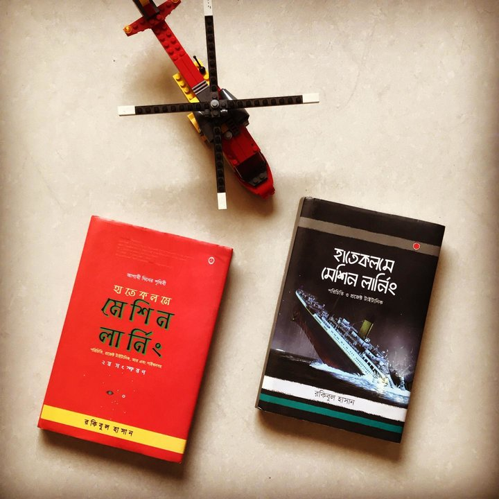



	ডাটা সাইন্স
	ডাটা ইঞ্জিনিয়ার
	বিজনেস অ্যানালিস্ট
	ডাটা অ্যানালিস্ট
	মেশিন লার্নিং ইঞ্জিনিয়ার

মার্কেট ডাটা বলছে, অনলাইন কোর্সগুলোর শেষ করার হার অসম্ভব ভাবে কম। কম দামে কোর্স কেনার কারণে অনেকে কোর্সগুলো গা করে শেষ করছেন না। এই ধারনাটাকে মাথায় রেখে তৈরি করা হচ্ছে ছোট ছোট মিনিপ্যাক ক্লাস, একদিনেই শেষ করা যায় এভাবে।
{: .notice-info}

## ১. কৃত্রিম বুদ্ধিমত্তা সিরিজ: মেশিন লার্নিং

এই সিরিজে থাকবে ৪টা কোর্স। এর প্রথমটি হচ্ছে *হাতেকলমে মেশিন লার্নিং* বইয়ের বুটক্যাম্প। এটাই গেটওয়ে কোর্স - বাকি সবগুলো কোর্সের জন্য।

## হাতেকলমে মেশিন লার্নিং বইয়ের বুটক্যাম্প

নন কম্পিউটিং ব্যাকগ্রাউন্ড থেকে সব ধরনের পেশাজীবীদের কথা মনে রেখে লেখা হয়েছিল হাতে কলমে মেশিন লার্নিং বইটা। ২০১৬-২০১৭ সালে। এটা এখন স্বতঃসিদ্ধ যে একজন বিজনেস প্রফেশনাল (নন প্রোগ্রামার) একদম শুরু থেকে মেশিন লার্নিং বুঝতে চাইলে আর প্রোগ্রামিং এনভারমেন্ট অনেকটাই গডসেন্ড। এই পুরো বইটাকে একনাগাড়ে, সলভ করা হয়েছে তিন ঘন্টার অনলাইন ক্লাসে।

	প্ল্যাটফর্ম:আর প্রোগ্রামিং এনভায়রনমেন্ট

(সময়ের স্বল্পতার কারণে বইটির গুরুত্বপূর্ণ অংশ সলভ করা হবে এই তিন ঘন্টার ক্লাসে)

পূর্বশর্ত: দ্বাদশ শ্রেণি, "হাতেকলমে মেশিন লার্নিং" বইটি

কাদের জন্য প্রযোজ্য;

| ১. | নন প্রোগ্রামার তবে মেশিন লার্নিং এর ধারণা পেতে চান |
| ২. | যাদের অংকের ধারনা নেই, তবে ভবিষ্যতে বুঝতে চান |
| ৩. | যারা কোন প্রোগ্রামিং এনভারমেন্ট সম্বন্ধে অবহিত নন |
| ৪. | যারা হাতে কলমে মেশিন লার্নিং বইটা কিনেছেন তবে শেষ করতে পারেননি |

এটা একদম শুরুর কোর্স। এটাকে "গেটওয়ে কোর্স" বলা যেতে পারে। এর আসল কোর্স আসলে চার সপ্তাহের। 
{: .notice-info}

## সহায়ক বই/ডকুমেন্টেশন (অনলাইন/প্রিন্ট)

<figure>
	
	<figcaption>ব্যবহৃত যেকোন একটা বই</figcaption>
</figure>

**প্রিরিকুইজিট:** যেকোন ১টা বই থাকতে হবে সাথে।

| বইয়ের নাম | অনলাইন লিংক | প্রিন্ট বই |
| :--- | :--- | :--- | :--- |
| হাতেকলমে মেশিন লার্নিং \(দ্বিতীয় সংস্করণ\) | [গিটবুক](https://rakibul-hassan.gitbook.io/mlbook-titanic/) | [রকমারি](https://rokomari.com/book/174186/) |
| হাতেকলমে মেশিন লার্নিং \(প্রথম সংস্করণ\) | [গিটবুক](https://rakibul-hassan.gitbook.io/mlbook-titanic/) | [রকমারি](https://www.rokomari.com/book/160337/) |

## অনলাইন এক্সেস, গিটহাব এবং আর-ষ্টুডিও ক্লাউড

১. [গিটহাব](https://github.com/) এর একটি অ্যাকাউন্ট প্রয়োজন।

২. [আর-ষ্টুডিও ক্লাউড](https://rstudio.cloud/) এর একটি অ্যাকাউন্ট খুলে ফেলুন ক্লাসের আগেই।

### রেজিস্ট্রেশন লিংক (মেশিন লার্নিং)

রেজিস্ট্রেশন করতে এখানে ক্লিক করুন। [আবেদন করুন এখানে](https://docs.google.com/forms/d/e/1FAIpQLSevjHblL-g0FabuvdNvVDEB1CYtQYeOwVKYMaEwctnUKM8B2w/viewform?usp=sf_link)।

## 

## ২. হাতেকলমে ডাটা অ্যানালাইটিক্স কোর্স

দ্বিতীয় মিনি কোর্স।

### ডাটা কী, ধারণা:  ১ম সপ্তাহ

| কোর্স কনটেন্ট | ভেতরের আলোচনা |
| :--- | :--- |
| ডেটা থেকে সিদ্ধান্ত নেবার ধারণা | অ্যানালাইটিক্যাল থিঙ্কিং, সেই কাজগুলোর কি ধরনের 'রোল' এবং স্কিলসেট দরকার? |
| ডেটার দুই চাকরি | ডেটা সাইন্টিস্ট এবং ডেটা এনালাইটিক্স এর মধ্যে পার্থক্য, ডেটা কিভাবে আমাদেরকে সিদ্ধান্ত নিতে সাহায্য করে? |
| ডেটার স্টোরি-টেলিং | কিভাবে ডেটা গল্প 'ডেভেলপ' করে সময়ের সাথে? গল্পগুলোর মধ্যে সংযোগস্থল কোথায়? |
| কোভিড-১৯ থেকে শেখা |কন্টাক্ট ট্রেসিং অ্যাপ, লক-ডাউনের ভবিষ্যদ্বাণী, কিভাবে মহামারি ছড়ায়? |
| লাইভ ডেমো - ডেটা কী কথা বলতে পারে? | টাইটানিক প্রজেক্ট: কে বেঁচে যাবেন শেষে? |
| ডেটা টুলবক্স | স্প্রেডশিট, ডেটা ভিজ্যুয়ালাইজেশন টুল, কোয়েরি ল্যাঙ্গুয়েজ এর ধারণা |
| প্রজেক্ট টাইটানিক | কিভাবে একজন মানুষের বাঁচামরা অ্যানালাইসিস করা যায় ডেটা থেকে? |

### ‘বিজনেস কোশ্চেন’ কী?: ২য় সপ্তাহ

| কোর্স কনটেন্ট | ভেতরের আলোচনা |
| :--- | :--- |
| ‘বিজনেস কোশ্চেন’ | সারা জীবন ধরে অনেক ‘বিজনেস কোশ্চেন’ এর উত্তর খুঁজে বেড়ানো |
| প্রজেক্ট টাইটানিক এর ‘বিজনেস কোশ্চেন’  | কোন ডেটা ইনফ্লুয়েন্স করছে একজন যাত্রীর বেচেঁ যাবার ব্যাপারে |
| বিজনেস ইন্টেলিজেন্স | ব্যবসায় ডেটার ব্যবহার, সেখানে অপটিমাইজেশন কিভাবে আসবে? |
| মাইক্রোসফট এক্সেল | কেস তৈরি |
| ট্যাবলিউ | কেস তৈরি |
| পাওয়ার বিআই | কেস তৈরি |

## সহায়ক বই/ডকুমেন্টেশন (অনলাইন/প্রিন্ট)

## বই, অনলাইন এক্সেস এবং গিটহাব

| বইয়ের নাম | অনলাইন | গিটহাব |
| :--- | :--- | :--- | :--- |
| মর্তের মানুষের ডেটা অ্যানালাইটিক্স | [অনলাইন](https://aiwithr.github.io/analyst/) | [গিটহাব](https://github.com/raqueeb/data_analyst) |

### রেজিস্ট্রেশন লিংক (অ্যানালাইটিক্স)

[আবেদন করুন এখানে](https://docs.google.com/forms/d/e/1FAIpQLSevjHblL-g0FabuvdNvVDEB1CYtQYeOwVKYMaEwctnUKM8B2w/viewform?usp=sf_link)