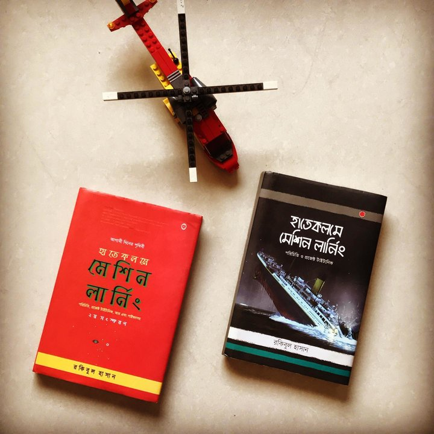

'বেসিক মেশিন লার্নিং' ট্রেনিং প্রোগ্রাম

> Recipes tell you nothing. Learning techniques is the key.
>
> — Tom Colicchio



অনার কোড (ডানপাশে টেনে দেখুন)
{: .notice-info}

```bash
১. মেশিন লার্নিং এ কোন *দ্যা সল্যুশন* নেই। সবাই ঠিক।
২. আমরা চেষ্টা করবো শিখতে, এই শেখাতে ভুল বলে কিছু নেই।
৩. সবারই *ইনপুট* মূল্যবান, ইনপুট দেবেন প্রতি স্টেজে।
৪. আমাদের চেষ্টা থাকবে মডেলের *অ্যাক্যুরেসি* বাড়াতে।
```

## কেন শিখবেন কৃত্রিম বুদ্ধিমত্তা?

১. যে একটা প্রযুক্তি অনেকটাই আমাদের অজান্তে সবাইকে ঘিরে ফেলছে সেটা হচ্ছে ‘কৃত্রিম বুদ্ধিমত্তা’। এক কথায় বললে বলা যেতে পারে ‘প্রযুক্তি’কে শেখানো হচ্ছে একদম মানুষের মতো করে সিদ্ধান্ত নিতে। মানুষের দরকারে। যেমন, হেলথকেয়ার সিস্টেমে রোগীদের ঠিকমতো স্বাস্থ্যসেবা দেবার জন্য, মানুষের ভুল কমানোর জন্য। পাশাপাশি কোন স্পেসিফিক ট্রিটমেন্টটা তাদের কাজে লাগছে - সেই ঔষুধ রোগীর উপর ব্যবহার না করে সিমুলেশনে ‘ড্রাগ ডিসকাভারি’তে ব্যবহার হচ্ছে এই কৃত্রিম বুদ্ধিমত্তা। আজকে ‘কোভিড-১৯’ এর ড্রাগ ডিসকাভারির পেছনে এই প্রযুক্তির সাপোর্ট অজানা নয়। সেটা না হলে এর সময় লাগতো আরো অনেক বেশি। মহামারী নিয়ন্ত্রণে অনেক দেশই ব্যবহার করছে এই প্রযুক্তি।

২. উন্নত দেশের সরকারগুলো কৃত্রিম বুদ্ধিমত্তাকে ব্যবহার করে আরবান প্ল্যানিং, মাস ট্রানজিট সিস্টেম, নদীর গতিপথ পরিবর্তন, বন্যার আর্লি ডিটেকশন, সরকারি রিসোর্সের সঠিক ডিস্ট্রিবিউশন এবং ব্যবহার, সামনের বছরগুলোতে পেনশনারদের কতো টাকা দিতে হতে পারে (উদাহরণস্বরূপ), ক্রাইম প্রেডিকশন, শহর জুড়ে ট্রাফিক ম্যানেজমেন্ট - এরকম হাজারো জিনিসে ব্যবহার হচ্ছে কৃত্রিম বুদ্ধিমত্তা। ওয়ার গেমিং এ এর ব্যবহারের পাশাপাশি সামরিক বাহিনীতে এই প্রযুক্তির ব্যবহারের একটা ধারণা এসেছে মার্কিন যুক্তরাস্ট্রে, ২০১৪ সালে ‘তৃতীয় অফসেট স্ট্রাটেজি’ হিসেবে। ২০১৮ সালে পেন্টাগন ২ বিলিয়ন ডলার খরচ করার একটা প্ল্যান দিয়েছে কৃত্রিম বুদ্ধিমত্তার ব্যবহার নিয়ে।

৩. ব্যাপারটা এমন - আমরা হয়তোবা ধরতে পারছিনা কিভাবে ঘটছে - তবে আমাদের আশেপাশের সবকিছুই পাল্টে যাচ্ছে এই 'কৃত্রিম বুদ্ধিমত্তা'য়ের প্রভাবে। আমরা চাই বা না চাই - জিনিসটা ঢুকে গেছে সবকিছুর ভেতরে। সন্তর্পণে। যেভাবে আমরা দেখেছি - হেলথকেয়ার থেকে শুরু করে সরকারি কাজ, ট্রান্সপোর্টেশন ইন্ডাস্ট্রি - শিক্ষা - যারা যা করতে চাইছেন তার সবকিছু সহজ করে দিচ্ছে এই জিনিস। এটা ঠিক যে, অনেক বড় একটা ক্ষমতা আসছে মানুষের হাতে - সেটা বুঝতে পারছে খুব কম মানুষই। কৃত্তিম বুদ্ধিমত্তার শুরুতে যেখানে মেশিনকে শেখাতে হয় - সেখানেই দরকার মেশিন লার্নিং। অন্য কথায় বললে - কৃত্তিম বুদ্ধিমত্তার যে অংশে যন্ত্রকে বুদ্ধিমত্তা দেবার প্রসেসই মেশিন লার্নিং।

৪. পৃথিবীতে *‘এআই’ ফর সোশ্যাল গুড* নিয়ে একটা বিশাল মুভমেন্ট চলছে ডেটাকে মানুষের কাজে ব্যবহারে। আমাদের হাতে প্রচুর ডেটা আছে, তবে সেই ডেটা থেকে প্রজ্ঞা নিতে পারছি না এমুহুর্তে। ডেটা থেকে প্রজ্ঞা নেবার প্রসেসগুলো দেখানো হবে এই প্রশিক্ষণে। 'মেশিন লার্নিং' ব্যাপারটা জেনে রাখা ভালো কারণ এর ব্যবহার চলে আসছে প্রতিটা সেক্টরে। কৃত্রিম বুদ্ধিমত্তা একটা বর্তমান এবং ভবিষ্যত স্কিলসেট।

## কিভাবে শিখবো? একটা সত্যিকারের সমস্যা সমাধান

মেশিন লার্নিং এর পেছনের দর্শন জানলে শেখা খুব সহজ হয়। আপনি তখন জানবেন কোন অবস্থান থেকে কোথায় যেতে হবে। এবং এখন কোথায় আছেন। যেহেতু আমার মেশিন লার্নিং বন্ধুরা আছেন পৃথিবী জুড়ে, তারা বলেন একটা কথা। যদি শিখতে চাও - মেশিন লার্নিং, তাহলে শুরু করো [‘প্রজেক্ট টাইটানিক’](http://kaggle.com/c/titanic) দিয়ে। *দিস ইস দ্য গেটওয়ে টু মেশিন লার্নিং*। পিরিয়ড। আপনি যদি সমস্যাটা ঠিকমতো বুঝতে পারেন তাহলে সমাধান হাতের কাছেই।

## লার্নিং আউটকাম: টাইটানিক চ্যালেঞ্জ

সাল ১৯১২। সত্যি ঘটনা। ধন্যবাদ দিতে হয় জেমস ক্যামেরনকে। উনি আমাকে বাঁচিয়েছেন নতুন করে গল্পটা ফাঁদতে। এই ‘আন-সিঙ্কেবল’ মানে ‘ডুববার নয়’ আরএমএস টাইটানিক’ ডুবে যায় আটলান্টিক পাড়ি দেবার সময়। একদম প্রথম যাত্রায়। আইসবার্গে ধাক্কা লেগে। তখন রাত ১১:৪০। ধারণা করতে পারি - ২২২৪ জন যাত্রী আর ক্রু’র মধ্যে প্রায় সবাই ঘুমাতে গিয়েছিলেন নিজ নিজ কেবিন অথবা বাঙ্কারে। পরের ঘটনা সবার জানা।

১৫০২ জন মারা যান ওই যাত্রায়।

এই সত্যি ঘটনাকে ঘিরে তৈরি করা হয়েছে এই কালজয়ী সমস্যা। এখানে আমাদেরকে দেয়া হয়েছে দুটো ডেটাসেট। একটাতে দেয়া হয়েছে ৮৯১জন মানুষের সম্পর্কে ১২টা ফিল্ড। সেখানে একটা ফিল্ড আছে যার মধ্যে বলা আছে উনি বেঁচে গিয়েছিলেন না মারা গিয়েছিলেন ওই যাত্রায়। খেয়াল করুন ব্যাপারটা। সত্যিকারের ডেটাসেট। ইন্টারনেটে আছে সবার নাম। দেয়া আছে তাদের ভাগ্য। বানানোর কিছু নেই এখানে।

এখন আসুন সমস্যাতে। আরেকটা ডেটাসেট দেয়া হয়েছে যার মধ্যে মানুষগুলোও নতুন। ওই ৮৯১ জনের বাইরের মানুষ উনারা। উনাদের ভাগ্য বের করবো আমরা। ৪১৮ জন প্যাসেন্জারের। সারিও ৪১৮টা। ওখানে সব ফিল্ড আছে ওই একটা ফিল্ড ছাড়া। যেটাতে বলা আছে উনি বেচেঁ অথবা মারা গিয়েছিলেন। আমরা জানি না তাদের ভাগ্যে কি ঘটেছিল।

## সমস্যা: প্রেডিক্ট করতে হবে কারা বেঁচে গিয়েছিলেন?

তো, টাইটানিক চ্যালেঞ্জটা কী?
{: .notice}

ওই ৪১৮জন মানুষের ডাটাসেট থেকে প্রেডিক্ট করে বের করতে হবে কারা বেঁচে অথবা মারা গিয়েছিলেন। আমি যখন প্রথম প্রথম এটা নিয়ে কাজ শুরু করি - তখন অবাকই হয়েছিলাম। এটা কিভাবে সম্ভব? আমি কিভাবে জানবো? মানুষের মৃত্যু প্রেডিক্ট করা আমাদের কম্ম নয়। আর মেশিন লার্নিংই বা কিভাবে পারবে?

<div class="badges">
	<span class="badge">আর প্রোগ্রামিং</span>
	<span class="badge info">মেশিন লার্নিং</span>
	<span class="badge warning">ক্যাগল প্রতিযোগিতা</span>
	<span class="badge danger">প্রজেক্ট টাইটানিক</span>
	<span class="badge success">প্রেডিকশন</span>
</div>

## এক নজরে (ট্রেনিং প্রোগ্রাম), টেবিলের ভেতরে লিংক

ইন্সট্রাকটর লেড ক্লাস ২ ঘন্টা, প্রজেক্ট নিয়ে কাজ ১ ঘন্টা = ৩ ঘন্টা ১ দিনে।

## ১ম সপ্তাহ (মেশিন লার্নিং, প্রজেক্ট টাইটানিক)

| দিন | বিষয় | কি শিখলাম? |
| :--- | :--- | :--- |
| ১ম | [মেশিন লার্নিং জিনিসটা কি?](https://rakibul-hassan.gitbook.io/mlbook-titanic/introduction/what-is-ml) | [সনাতন প্রোগ্রামিং এবং মেশিন লার্নিং এর পার্থক্য](https://rakibul-hassan.gitbook.io/mlbook-titanic/introduction/why-data) |
| ২য় | [ক্যাগল প্রতিযোগিতা](https://rakibul-hassan.gitbook.io/mlbook-titanic/kaggle/why-kaggle) | [ক্যাগল কার্নাল এবং অনলাইন হোস্টেড স্ক্রিপ্ট](https://rakibul-hassan.gitbook.io/mlbook-titanic/kaggle/why-kaggle) |
| ৩য় | [প্রজেক্ট টাইটানিক](https://rakibul-hassan.gitbook.io/mlbook-titanic/project-titanic/titanic-story) | [‘ট্রেনিং’ আর ‘টেস্ট’ ডাটা সেট](https://rakibul-hassan.gitbook.io/mlbook-titanic/project-titanic/trg-test) |

## ২য় সপ্তাহ ("আর" প্রোগ্রামিং এনভায়রনমেন্ট)

| দিন | বিষয় | কি শিখলাম? |
| :--- | :--- | :--- |
| ১ম | ["আর" প্রোগ্রামিং এনভায়রনমেন্ট](https://rakibul-hassan.gitbook.io/mlbook-titanic/r-environment/r-r-studio) | ["আর" + "আর" ষ্টুডিও এর ব্যবহার](https://rakibul-hassan.gitbook.io/mlbook-titanic/r-environment/r-studio-installation) |
| ২য় | [প্রজেক্টের গিটহাব স্ক্রিপ্ট](https://rakibul-hassan.gitbook.io/mlbook-titanic/r-environment/github-script) | [প্রজেক্ট টাইটানিক + 'আর' ষ্টুডিও](https://rakibul-hassan.gitbook.io/mlbook-titanic/r-environment/r-commands) |
| ৩য় | [প্রজেক্ট টাইটানিক + 'আর' ষ্টুডিও, ওয়েব ভার্সন](https://rakibul-hassan.gitbook.io/mlbook-titanic/r-environment/r-commands) | [টাইটানিকের ডাটাসেট - সাইট ক্যাগল](https://rakibul-hassan.gitbook.io/mlbook-titanic/r-environment/r-commands) |

## ৩য় সপ্তাহ (প্রেডিকশন, ডাটা ভিজ্যুয়ালাইজেশন)

| দিন | বিষয় | কি শিখলাম? |
| :--- | :--- | :--- |
| ১ম | [প্রথম প্রেডিকশন, সবাই কি মারা গিয়েছেন?](https://rakibul-hassan.gitbook.io/mlbook-titanic/prediction/1stprediction) | [এক্সপ্লোরেটরি ডাটা অ্যানালাইসিস, ক্যাগল সাবমিশন](https://rakibul-hassan.gitbook.io/mlbook-titanic/prediction/1stprediction) |
| ২য় | [ডাটা ভিজ্যুয়ালাইজেশন, ছবির কথা](https://rakibul-hassan.gitbook.io/mlbook-titanic/prediction/data-munging) | [কি তথ্য পেলাম ডাটা ভিজ্যুয়ালাইজেশন থেকে?](https://rakibul-hassan.gitbook.io/mlbook-titanic/prediction/data-munging) |
| ৩য় | [দ্বিতীয় প্রেডিকশন, মহিলা না পুরুষ?](https://rakibul-hassan.gitbook.io/mlbook-titanic/prediction/2ndprediction) | [মহিলা এবং বাচ্চাদের আগে](https://rakibul-hassan.gitbook.io/mlbook-titanic/prediction/2ndprediction) |

## ৪র্থ সপ্তাহ (ডিসিশন ট্রি, ফিচার ইঞ্জিনিয়ারিং)

| দিন | বিষয় | কি শিখলাম? |
| :--- | :--- | :--- |
| ১ম | [মৃত্যুর সাথে টিকিটের দামের সম্পর্ক](https://rakibul-hassan.gitbook.io/mlbook-titanic/prediction/3rdprediction) | [তৃতীয় প্রেডিকশন, "এগ্রিগেট” কমান্ড](https://rakibul-hassan.gitbook.io/mlbook-titanic/prediction/3rdprediction) |
| ২য় | [ডিসিশন ট্রি, চতুর্থ প্রেডিকশন](https://rakibul-hassan.gitbook.io/mlbook-titanic/prediction/decision-tree) | [rpart, প্রেডিক্টিভ এলিমেন্ট](https://rakibul-hassan.gitbook.io/mlbook-titanic/prediction/4thprediction) |
| ৩য় | [ডাটা প্রি-প্রসেসিং, ফিচার ইঞ্জিনিয়ারিং](https://rakibul-hassan.gitbook.io/mlbook-titanic/prediction/5thprediction) | [ডাটা ক্লিনিং, ডাটাকে ঠিক করা](https://rakibul-hassan.gitbook.io/mlbook-titanic/prediction/6th-prediction) |
| ৪র্থ | [সপ্তম প্রেডিকশন \(র‌্যান্ডম ফরেস্ট\)](https://rakibul-hassan.gitbook.io/mlbook-titanic/prediction/7th-prediction) | [মেশিন লার্নিং এবং আমাদের ভবিষ্যৎ](https://rakibul-hassan.gitbook.io/mlbook-titanic/whats-in-future/in-future)  |

## অনলাইন এক্সেস, গিটহাব এবং আর-ষ্টুডিও ক্লাউড

১. [গিটহাব](https://github.com/) এর একটি অ্যাকাউন্ট প্রয়োজন।

২. [আর-ষ্টুডিও ক্লাউড](https://rstudio.cloud/) এর একটি অ্যাকাউন্ট খুলে ফেলুন ক্লাসের আগেই।

## সহায়ক বই/ডকুমেন্টেশন (অনলাইন)

<figure>
	<a href="../images/mlbook1.jpg"></a>
	<figcaption>ব্যবহৃত যেকোন একটা বই</figcaption>
</figure>

হাতেকলমে মেশিন লার্নিং (প্রথম অথবা দ্বিতীয় সংস্করণ) বইয়ের সব লিংক
{: .notice-info}

| মিডিয়ামের নাম | লিংক |
| :--- | :--- |
|  [অনলাইন লিংক](https://rakibul-hassan.gitbook.io/mlbook-titanic/) | [গিটবুক, সম্পুর্ন বই অনলাইনে](https://rakibul-hassan.gitbook.io/mlbook-titanic/) |
|  [প্রিন্ট বই, রকমারি](https://rokomari.com/book/174186/) | [রকমারি.কম](https://rokomari.com/book/174186/) |
|  [প্রিন্ট বই, আদর্শ](https://adarsha.com.bd/shop/hatekolome-machine-learning/) | [আদর্শ প্রকাশনী](https://adarsha.com.bd/shop/hatekolome-machine-learning/) |
| [ প্রিন্ট বই, নীলক্ষেত](https://www.facebook.com/%E0%A6%B9%E0%A6%95-%E0%A6%B2%E0%A6%BE%E0%A6%87%E0%A6%AC%E0%A7%8D%E0%A6%B0%E0%A7%87%E0%A6%B0%E0%A7%80-%E0%A6%A8%E0%A7%80%E0%A6%B2%E0%A6%95%E0%A7%8D%E0%A6%B7%E0%A7%87%E0%A6%A4%E0%A6%A2%E0%A6%BE%E0%A6%95%E0%A6%BE-996072720590097/) | [হক, মানিক লাইব্রেরি সহ অনেকে, ০১৭৩৫৭৪২৯০৮, ০১৮২০১৫৭১৮১ ](https://www.facebook.com/ManikLibraryOnline) |
|  [ইবুক, আমাজন](https://www.amazon.com/dp/B089NTNG3R/) | [কিন্ডল এডিশন](https://www.amazon.com/dp/B089NTNG3R/) |
|  [ইবুক, গুগল বুকস](https://play.google.com/store/books/details?id=7xbpDwAAQBAJ) | [বাংলাদেশে গুগল প্লে অ্যাপ](https://play.google.com/store/books/details?id=7xbpDwAAQBAJ) |

## মোবাইল ফ্রেন্ডলি লিংক (বই)

১. [অনলাইন লিংক, সম্পুর্ন বই অনলাইনে](https://rakibul-hassan.gitbook.io/mlbook-titanic/)

২. [প্রিন্ট বই, রকমারি](https://rokomari.com/book/174186/)

৩. [প্রিন্ট বই, আদর্শ](https://adarsha.com.bd/shop/hatekolome-machine-learning/)

৪. [প্রিন্ট বই, নীলক্ষেত]()

৫. [ইবুক, আমাজন](https://www.amazon.com/dp/B089NTNG3R/)

৬. [ইবুক, গুগল বুকস](https://play.google.com/store/books/details?id=7xbpDwAAQBAJ) 

## সহায়ক বই/ডকুমেন্টেশন এর টেবিল অফ কনটেন্ট
<figure>
	<a href="../images/toc1.png"></a>
	<figcaption>বইয়ের টেবিল অফ কনটেন্ট ১</figcaption>
</figure>
<figure>
	<a href="../images/toc2.png"></a>
	<figcaption>বইয়ের টেবিল অফ কনটেন্ট ২</figcaption>
</figure>
<figure>
  <a href="../images/toc3.png"></a>
	<figcaption>বইয়ের টেবিল অফ কনটেন্ট ৩</figcaption>
</figure>
## সহায়ক ভিডিও (যদি ক্লাস বাদ পড়ে)

ইউটিউব প্লেলিস্ট: [মেশিন লার্নিং (দ্বিতীয় সংস্করণ) বইয়ের ভিডিও সিরিজ](https://www.youtube.com/playlist?list=PL5NPSn95n_L4AUOUjfZamspLzCAEeJW3p)

ট্রেনিং নিয়ে প্রতিদিনের ইনপুট দেয়া যাবে ০১৭১৩০৯৫৭৬৭ নম্বরে। ধন্যবাদ।
{: .notice}

## আবেদনের নিয়ম

হাতেকলমে "ডেটা-অ্যানালাইটিক্স"  (৫ নম্বরে বর্ণিত বিষয়ে ঠিকমতো উত্তর দেয়া জরুরি)

- [x] ১. বিনামূল্যে (জ্ঞানের দাম ব্যক্তি নির্ভর), শুরুতে ৫ ব্যাচ। এখানে আমার কাজ হচ্ছে আপনাকে ডেটার রাস্তা ধরিয়ে দেয়া। রাস্তায় তুলে দেবার দ্বায়িত্ব আমার। আপনার "আগ্রহ"  থাকলেই হবে। শুরুতেই "নো কোডিং"। শুধুমাত্র 'নন-প্রোগ্রামিং' ব্যাকগ্রাউন্ডের ছাত্রছাত্রীরা আবেদন করবেন।

- [x] ২. বিনামূল্যে করানোর পেছনের কারণ একদম আমার ব্যক্তিগত। আপনাদের দেয়া তথ্যের ভিত্তিতে ছাত্র-ছাত্রীদের সাথে (১-১) ভিত্তিতে ইন্টারভিউ নিয়ে তৈরি হবে ২৫ জনের একেকটা ব্যাচ। 

- [x] ৩. অভিজ্ঞতা বলে, দেশে ডেটার ব্যবহার কম বলে এই 'অসাধারণ' স্কিলসেট ধরতে পারছি না। আপনার বর্তমান চাকরির পাশাপাশি এই স্কিল সাহায্য করবে ভবিষ্যৎ "জব ওপেনিং"গুলোতে। চাকরি আসছে সামনে। দরকার একটা স্কিল। ঔৎসুক্য (বিশেষ্য পদ) আগ্রহ, ব্যাকুলতা, উৎসুক ভাব। আর কিছু লাগবে না। বাকিটা আমি শিখিয়ে নেব। 

[১ম ব্যাচ: ১৭ জুলাই - ১৪ অগাস্ট, ২০২১, ৯০ মিনিট অনলাইন (গুগল মিট) ক্লাস। শুক্র-শনিবার, সকালে অথবা সন্ধ্যায়। আলোচনা সাপেক্ষ। ১০ জন ছাত্রী + ১০ জন ছাত্র + ৫ জন (আমার পিক)]
{: .notice-info}

- [x] ৪. আমি দেখেছি - 'কগনিটিভ রিজনিং', মেটা অ্যানালাইসিস এবং ডেটা থেকে প্যাটার্ন অ্যানালাইসিসে ছাত্রীরা পিছিয়ে নেই। সেকারণে সমান সংখ্যক ভ্যাকেন্সি।

- [x] ৫. বিনামূল্যের এই "মেন্টরশীপ" সার্ভিসের দাম থাকে না বলে দরকার বিশাল 'কমিটমেন্ট', আপনাদের নিজের কাছে। আপনাদের শক্তিশালী 'কমিটমেন্ট' যাঁচাই একারণে এই তিনটি প্রশ্ন। আমাকে সাহায্য করুন - প্রশ্নের উত্তরগুলো ঠিকমতো দিয়ে; যাতে আপনাকে ঠিকমতো সাহায্য করতে পারি। বুদ্ধিদীপ্ত উত্তর আশা করছি। উত্তরের ভিত্তিতে 'সিলেকশন' হবে।

- [x] ৬. আপনাদের সুবিধার জন্য এই তিনটে প্রশ্নের উত্তর আছে ইউটিউব প্লে-লিস্টে। প্রথম কয়েকটা বাদ  দিয়ে দেখতে পারেন। [প্লে-লিস্ট:](https://youtube.com/playlist?list=PL5NPSn95n_L4Z5bpCOqHW_QU8nxgywGM2)

(এই আবেদনের সময়সীমা ০৮ জুলাই ২০২১ পর্যন্ত, আপনার উত্তর এডিট করতে পারবেন এর মধ্যে)
{: .notice}

