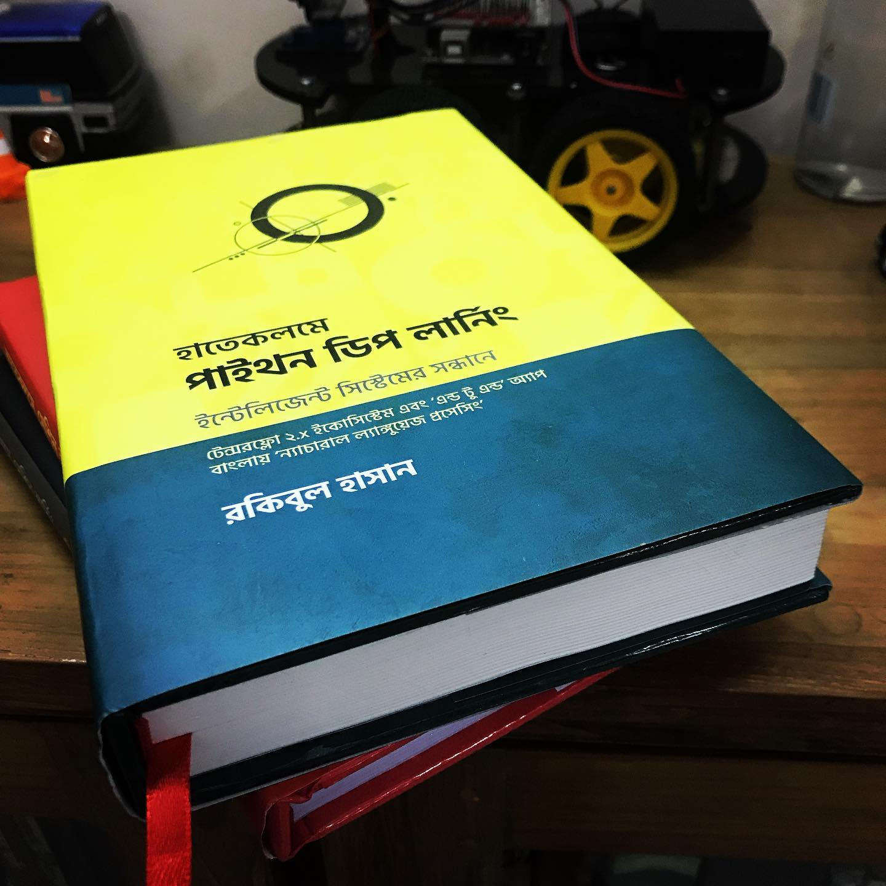



## ৪ সপ্তাহের ডেটা-সাইন্স মেন্টরশীপ


## ক্যাডেট কলেজের ফর্ম-মাস্টার

ক্লাস সেভেনে গিয়ে পড়লাম ক্যাডেট কলেজে। আমাদের ফর্মে (সেকশন) ২৫ জন। সঙ্গে একজন 'ডেডিকেটেড' ফর্ম-মাস্টার। যার কাজ হচ্ছে এই ২৫ জনের সবকিছু দেখভাল করা। উনি নিজে জ্যামিতির শিক্ষক হলেও রসায়ন অথবা জীববিজ্ঞানে কেন খারাপ করলাম তার কৈফিয়ত দিতে দিতে জীবন শেষ। এদিকে আমাদের এই ২৫ জনের দুষ্টুমির দায়ভার নিতে হতো কলেজের ম্যানেজমেন্টের সাথে। 'প্যারেন্টস-ডে'তে মা-বাবা আসতে না পারলে উনি প্রক্সি দিতেন। রোগশোকে, হাসপাতালে ভর্তি থাকলে ডিউটি মাস্টারের পাশাপাশি খোঁজে থাকতেন এই পিতৃতুল্য মানুষটা। কর্ম জীবনে অর্থাৎ মানুষ হয়ে যাবার পরও যাদের সাথে দেখা হলে যার চোখ ভরে থাকতো স্নেহ - উনি সেই ফর্ম-মাস্টার।

## মিলিটারি অ্যাকাডেমীর প্লাটুন কমান্ডার

৩ বছরের মিলিটারি একাডেমীর একেকজন ক্যাডেটের সবকিছু যার নখদর্পনে থাকে তিনি হচ্ছে ২০ জনের একটা প্লাটুনের - প্লাটুন কমান্ডার। একদম বেসামরিক ছাত্র থেকে একজন সামরিক অফিসার তৈরিতে উনার প্রতিটা মুহুর্তের 'কমিটেড ইনভলভমেন্ট' দেখার মতো। ভোরের মাইলটেস্ট (একটা নির্দিস্ট সময়ের মধ্যে ১, ২, ১০ মাইল পাড়ি দিতে পারা) থেকে রাতে ঘুমুতে যাবার আগে ডায়েরি লেখা 'এনস্যুর' করা - প্রতিটা ক্যাডেটকে 'লিডারশিপ ইনফিউজ' করে মানুষের মতো মানুষ বানানো এই মানুষটার কাজ।

## ডেটা সাইন্স, নন-প্রোগ্রামারদের জন্য

ধরে নিচ্ছি - পৃথিবীতে দু ধরনের মানুষ আছে। (১) নন-প্রোগ্রামার, (২) প্রোগ্রামার।

কেন বললেন এই কথা? আপনার প্রশ্ন। কারণ তাদের ‘প্রেজুডিস’ থাকে না - মানে ‘আমি এটা জানি ওটা জানি’। ফলে তারা মনোযোগী হন না পুরো সময় ধরে। ফলে মিস করেন অনেক কানেক্টিং লিংক। এটা অনেক ইম্পর্টেন্ট। তবে ‘আসল’ ভালো প্রোগ্রামাররা সারাজীবন ওপেন মাইন্ডেড থাকেন নতুন কিছু শিখতে।

যারা নন-প্রোগ্রামার, তাদের মধ্যে বেশিরভাগ আসেন এই মনোভাব নিয়ে ‘আমি তো কিছুই জানি না’, আমাকে শিখতে হবে। ‘রেইন অর শাইন’। এটা তাদের জন্য জীবন মরণ সমস্যা। তাই, তারা অনেকটাই ওপেন মাইন্ডেড। তারা জানেন, এই জিনিস শিখতে আমার যা যা শেখার দরকার সেটা শিখতেই হবে।

## ক্রিটিক্যাল থিঙ্কিং

> The essence of the independent mind lies not in what it thinks, but in how it thinks.

> — Christopher Hitchens

ডেটা সায়েন্টিস্ট হিসেবে যে কয়েকটা স্কিলসেট দরকার - তার মধ্যে (ক) কিছু অবজেক্টের মধ্যে রিলেশন, (খ) প্যাটার্ন বের করতে পারা, (গ) ডেটার মধ্যে থেকে প্রশ্ন খুঁজে বের করতে পারা

## ৪ সপ্তাহের মেন্টরশীপ

আমি ছোটবেলা থেকেই অফিশিয়াল ডকুমেন্টেশনে বিশ্বাসী। যাকে আমরা বলি RTFM, ‘রিড দ্য ফাইন ম্যানুয়াল’ চলে আসছে সেই নিউজ গ্রুপের যুগ থেকে। ছোটবেলায় কমোডরের সঙ্গে আসা সেই ‘জি ডব্লিউ বেসিক’-এর সেই ম্যানুয়াল আমাকে দেখিয়েছিল কীভাবে অফিশিয়াল ডকুমেন্টেশন অসাধারণ হয়। আচ্ছা, যিনি একটা প্রোডাক্ট বানিয়েছেন, তার তৈরি ম্যানুয়াল ভালো হবে না আর কারটা হবে?
{: .notice}


<div class="badges">
	<span class="badge">আর প্রোগ্রামিং</span>
	<span class="badge info">পাইথন প্রোগ্রামিং</span>
	<span class="badge warning">পাইথন+আর প্রোগ্রামিং</span>
	<span class="badge danger">পাইথন ডিপ লার্নিং</span>
	<span class="badge success">ন্যাচারাল ল্যাঙ্গুয়েজ প্রসেসিং</span>
</div>

## নতুন (নীতিনির্ধারণী বই) এর লিংক

[কৃত্রিম বুদ্ধিমত্তা, আমাদের ভবিষ্যৎ: নীতিনির্ধারণী আলাপ - বাংলাদেশ](https://aiwithr.github.io/aibook/) 

<div class="badges">
	<span class="badge">খসড়া</span>
	<span class="badge info">নীতিনির্ধারণী</span>
	<span class="badge success">বাংলাদেশ</span>
</div>

## এক নজরে (টেবিলের ভেতরে লিংক)

| বইয়ের নাম | অনলাইন লিংক | প্রিন্ট বই |
| :--- | :--- | :--- | :--- |
| হাতেকলমে মেশিন লার্নিং \(দ্বিতীয় সংস্করণ\) | [গিটবুক](https://rakibul-hassan.gitbook.io/mlbook-titanic/) | [রকমারি](https://rokomari.com/book/174186/) |
| প্রথম সংস্করনে নেই যে পাইথন অংশ | [গিটবুক](https://rakibul-hassan.gitbook.io/mlbook-titanic/j_notebook/titanic-project-test) | [রকমারি](https://rokomari.com/book/174186/) |
| 'শূন্য থেকে পাইথন মেশিন লার্নিং' \(দ্বিতীয় সংস্করণ\) | [গিটবুক](https://raqueeb.gitbook.io/scikit-learn/) | [রকমারি](https://www.rokomari.com/book/187277/) |
| হাতেকলমে পাইথন ডিপ লার্নিং | [গিটবুক](https://rakibul-hassan.gitbook.io/deep-learning/) | [রকমারি](https://www.rokomari.com/book/198757/) |
| হাতেকলমে বাংলা ন্যাচারাল ল্যাঙ্গুয়েজ প্রসেসিং | [অনলাইন-বই](https://aiwithr.github.io/nlpbook/) | [রকমারি](https://www.rokomari.com/book/209335/) |
| কৃত্রিম বুদ্ধিমত্তা: নীতিনির্ধারণী আলাপ - বাংলাদেশ | [অনলাইন](https://aiwithr.github.io/aibook/) | [ইন্টারফেস](https://raqueeb.github.io/excel/) |
| চারটা বই একসাথে কেনার লিঙ্ক | আসবে | [রকমারি](https://www.rokomari.com/book/187570/) |
| নীলক্ষেত থেকে কেনার ব্যবস্থা | [প্রিন্ট বই, নীলক্ষেত, হক, মানিক লাইব্রেরি সহ অনেকে](https://www.facebook.com/%E0%A6%B9%E0%A6%95-%E0%A6%B2%E0%A6%BE%E0%A6%87%E0%A6%AC%E0%A7%8D%E0%A6%B0%E0%A7%87%E0%A6%B0%E0%A7%80-%E0%A6%A8%E0%A7%80%E0%A6%B2%E0%A6%95%E0%A7%8D%E0%A6%B7%E0%A7%87%E0%A6%A4%E0%A6%A2%E0%A6%BE%E0%A6%95%E0%A6%BE-996072720590097/)| [ফোন: ০১৭৩৫৭৪২৯০৮, ০১৮২০১৫৭১৮১](https://www.facebook.com/ManikLibraryOnline) |

## বাংলায় ডিপ লার্নিংয়ের একমাত্র বই


<div class="badges">
	<span class="badge info">পাইথন প্রোগ্রামিং</span>
	<span class="badge danger">পাইথন ডিপ লার্নিং</span>
	<span class="badge success">ন্যাচারাল ল্যাঙ্গুয়েজ প্রসেসিং</span>
</div>

## আমাজন কিন্ডেল এডিশন (গ্লোবাল মার্কেট)

* [হাতেকলমে মেশিন লার্নিং \(দ্বিতীয় সংস্করণ\)](https://www.amazon.com/dp/B089NTNG3R/)
* [শূন্য থেকে পাইথন মেশিন লার্নিং \(দ্বিতীয় সংস্করণ\)](https://www.amazon.com/dp/B089NWHC96/)
* [হাতেকলমে পাইথন ডিপ লার্নিং](https://www.amazon.com/gp/product/B08FGVM5DL)

## গুগল প্লে বুকস (গুগল বুকস, গ্লোবাল মার্কেট), বাংলাদেশের জন্য নয়

* [হাতেকলমে মেশিন লার্নিং \(দ্বিতীয় সংস্করণ\)](https://play.google.com/store/books/details?id=7xbpDwAAQBAJ)
* [শূন্য থেকে পাইথন মেশিন লার্নিং \(দ্বিতীয় সংস্করণ\)](https://play.google.com/store/books/details?id=cFzeDwAAQBAJ)
* [হাতেকলমে পাইথন ডিপ লার্নিং](https://play.google.com/store/books/details?id=6xbeDwAAQBAJ)

## গিটবুক/অনলাইন প্ল্যাটফর্ম

আমার খসড়া বইগুলো **সবসময়ই** ফ্রি থাকবে অনলাইনে \(গিটবুকে\)। অন্য ফরম্যাটের বইগুলো কিনতে হবে না এমুহুর্তে। পরে কিনতে পারেন। সব বইগুলো অনলাইনে আছে। 'আন-এডিটেড'। আসল বইগুলো বাজারে আসার আগেই পাবলিশিং হাউস প্রফেশনালি এডিট করে দিয়েছেন।
{: .notice-info}

* [প্রথম গিটবুক, হাতেকলমে মেশিন লার্নিং](https://raqueeb.gitbooks.io/mlbook-titanic/content/)
* [দ্বিতীয় গিটবুক, টাইটানিক -পাইথন অংশ](https://rakibul-hassan.gitbook.io/mlbook-titanic/j_notebook/titanic-project-test)
* [তৃতীয় গিটবুক, শুন্য থেকে পাইথন মেশিন লার্নিং](https://raqueeb.gitbook.io/scikit-learn/)
* [চতুর্থ গিটবুক, পাইথন ডিপ লার্নিং](https://www.rokomari.com/book/198757/)
* [পঞ্চম অনলাইন বুক, ন্যাচারাল ল্যাঙ্গুয়েজ প্রসেসিং](https://aiwithr.github.io/nlpbook/)
* [ষষ্ঠ অনলাইন বই, কৃত্রিম বুদ্ধিমত্তা, নীতিনির্ধারণী আলাপ - বাংলাদেশ](https://aiwithr.github.io/aibook/)

## কোন বইয়ের পর কোন বই ব্যবহার করবো?

```bash
মেশিন লার্নিং বই
১. ├── লাল বই = হাতেকলমে মেশিন লার্নিং 
-. | অথবা
২. ├── কালো বই = বাজারে নেই, লাল বইয়ের প্রথম সংস্করণ
৩. ├── কৃত্রিম বুদ্ধিমত্তা, নীতিনির্ধারণী আলাপ - বাংলাদেশ
৪.     ├── সাদা বই = শূন্য থেকে পাইথন মেশিন লার্নিং                        
৫.         ├── সবুজ-হলুদ = হাতেকলমে পাইথন ডিপ লার্নিং       # অ্যাডভান্সড ব্যবহারকারীদের জন্য   
৬.            └── নীল-সাদা = হাতেকলমে বাংলা ন্যাচারাল ল্যাঙ্গুয়েজ প্রসেসিং   # যারা ল্যাঙ্গুয়েজ নিয়ে কাজ করতে চান
```


## ফেইসবুক, প্লেলিস্ট আছে ভেতরে

২০০+ ভিডিও, [এখানে](https://www.facebook.com/mltraining/videos)।

## ওয়েবসাইট

একটা বুকমার্ক পজিশন [এখানে](https://aiwithr.github.io/)।

## অ্যামাজন অন ডিমান্ড প্রিন্ট

আসছে সামনে।
