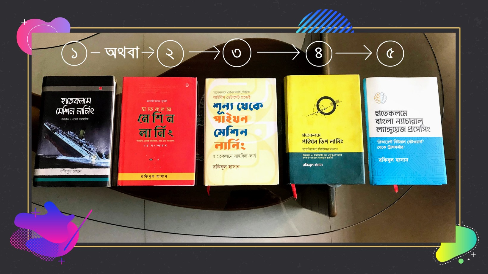



আমি ছোটবেলা থেকেই অফিশিয়াল ডকুমেন্টেশনে বিশ্বাসী। যাকে আমরা বলি RTFM, ‘রিড দ্য ফাইন ম্যানুয়াল’ চলে আসছে সেই নিউজ গ্রুপের যুগ থেকে। ছোটবেলায় কমোডরের সঙ্গে আসা সেই ‘জি ডব্লিউ বেসিক’-এর সেই ম্যানুয়াল আমাকে দেখিয়েছিল কীভাবে অফিশিয়াল ডকুমেন্টেশন অসাধারণ হয়। আচ্ছা, যিনি একটা প্রোডাক্ট বানিয়েছেন, তার তৈরি ম্যানুয়াল ভালো হবে না আর কারটা হবে?
{: .notice}


<div class="badges">
	<span class="badge">আর প্রোগ্রামিং</span>
	<span class="badge info">পাইথন প্রোগ্রামিং</span>
	<span class="badge warning">পাইথন+আর প্রোগ্রামিং</span>
	<span class="badge danger">পাইথন ডিপ লার্নিং</span>
	<span class="badge success">ন্যাচারাল ল্যাঙ্গুয়েজ প্রসেসিং</span>
</div>

## নতুন (নীতিনির্ধারণী বই) এর লিংক

[কৃত্রিম বুদ্ধিমত্তা, আমাদের ভবিষ্যৎ: নীতিনির্ধারণী আলাপ - বাংলাদেশ](https://aiwithr.github.io/aibook/) 

<div class="badges">
	<span class="badge">খসড়া</span>
	<span class="badge info">নীতিনির্ধারণী</span>
	<span class="badge success">বাংলাদেশ</span>
</div>

## এক নজরে (টেবিলের ভেতরে লিংক)

| বইয়ের নাম | অনলাইন লিংক | প্রিন্ট বই |
| :--- | :--- | :--- | :--- |
| হাতেকলমে মেশিন লার্নিং \(দ্বিতীয় সংস্করণ\) | [গিটবুক](https://rakibul-hassan.gitbook.io/mlbook-titanic/) | [রকমারি](https://rokomari.com/book/174186/) |
| প্রথম সংস্করনে নেই যে পাইথন অংশ | [গিটবুক](https://rakibul-hassan.gitbook.io/mlbook-titanic/j_notebook/titanic-project-test) | [রকমারি](https://rokomari.com/book/174186/) |
| 'শূন্য থেকে পাইথন মেশিন লার্নিং' \(দ্বিতীয় সংস্করণ\) | [গিটবুক](https://raqueeb.gitbook.io/scikit-learn/) | [রকমারি](https://www.rokomari.com/book/187277/) |
| হাতেকলমে পাইথন ডিপ লার্নিং | [গিটবুক](https://rakibul-hassan.gitbook.io/deep-learning/) | [রকমারি](https://www.rokomari.com/book/198757/) |
| হাতেকলমে বাংলা ন্যাচারাল ল্যাঙ্গুয়েজ প্রসেসিং | [অনলাইন-বই](https://aiwithr.github.io/nlpbook/) | [রকমারি](https://www.rokomari.com/book/209335/) |
| কৃত্রিম বুদ্ধিমত্তা: নীতিনির্ধারণী আলাপ - বাংলাদেশ | [অনলাইন](https://aiwithr.github.io/aibook/) | [ইন্টারফেস](https://raqueeb.github.io/excel/) |
| চারটা বই একসাথে কেনার লিঙ্ক | আসবে | [রকমারি](https://www.rokomari.com/book/187570/) |
| নীলক্ষেত থেকে কেনার ব্যবস্থা | [প্রিন্ট বই, নীলক্ষেত, হক, মানিক লাইব্রেরি সহ অনেকে](https://www.facebook.com/%E0%A6%B9%E0%A6%95-%E0%A6%B2%E0%A6%BE%E0%A6%87%E0%A6%AC%E0%A7%8D%E0%A6%B0%E0%A7%87%E0%A6%B0%E0%A7%80-%E0%A6%A8%E0%A7%80%E0%A6%B2%E0%A6%95%E0%A7%8D%E0%A6%B7%E0%A7%87%E0%A6%A4%E0%A6%A2%E0%A6%BE%E0%A6%95%E0%A6%BE-996072720590097/)| [ফোন: ০১৭৩৫৭৪২৯০৮, ০১৮২০১৫৭১৮১](https://www.facebook.com/ManikLibraryOnline) |

## বাংলায় ডিপ লার্নিংয়ের একমাত্র বই


<div class="badges">
	<span class="badge info">পাইথন প্রোগ্রামিং</span>
	<span class="badge danger">পাইথন ডিপ লার্নিং</span>
	<span class="badge success">ন্যাচারাল ল্যাঙ্গুয়েজ প্রসেসিং</span>
</div>

## আমাজন কিন্ডেল এডিশন (গ্লোবাল মার্কেট)

* [হাতেকলমে মেশিন লার্নিং \(দ্বিতীয় সংস্করণ\)](https://www.amazon.com/dp/B089NTNG3R/)
* [শূন্য থেকে পাইথন মেশিন লার্নিং \(দ্বিতীয় সংস্করণ\)](https://www.amazon.com/dp/B089NWHC96/)
* [হাতেকলমে পাইথন ডিপ লার্নিং](https://www.amazon.com/gp/product/B08FGVM5DL)

## গুগল প্লে বুকস (গুগল বুকস, গ্লোবাল মার্কেট), বাংলাদেশের জন্য নয়

* [হাতেকলমে মেশিন লার্নিং \(দ্বিতীয় সংস্করণ\)](https://play.google.com/store/books/details?id=7xbpDwAAQBAJ)
* [শূন্য থেকে পাইথন মেশিন লার্নিং \(দ্বিতীয় সংস্করণ\)](https://play.google.com/store/books/details?id=cFzeDwAAQBAJ)
* [হাতেকলমে পাইথন ডিপ লার্নিং](https://play.google.com/store/books/details?id=6xbeDwAAQBAJ)

## গিটবুক/অনলাইন প্ল্যাটফর্ম

আমার খসড়া বইগুলো **সবসময়ই** ফ্রি থাকবে অনলাইনে \(গিটবুকে\)। অন্য ফরম্যাটের বইগুলো কিনতে হবে না এমুহুর্তে। পরে কিনতে পারেন। সব বইগুলো অনলাইনে আছে। 'আন-এডিটেড'। আসল বইগুলো বাজারে আসার আগেই পাবলিশিং হাউস প্রফেশনালি এডিট করে দিয়েছেন।
{: .notice-info}

* [প্রথম গিটবুক, হাতেকলমে মেশিন লার্নিং](https://raqueeb.gitbooks.io/mlbook-titanic/content/)
* [দ্বিতীয় গিটবুক, টাইটানিক -পাইথন অংশ](https://rakibul-hassan.gitbook.io/mlbook-titanic/j_notebook/titanic-project-test)
* [তৃতীয় গিটবুক, শুন্য থেকে পাইথন মেশিন লার্নিং](https://raqueeb.gitbook.io/scikit-learn/)
* [চতুর্থ গিটবুক, পাইথন ডিপ লার্নিং](https://www.rokomari.com/book/198757/)
* [পঞ্চম অনলাইন বুক, ন্যাচারাল ল্যাঙ্গুয়েজ প্রসেসিং](https://aiwithr.github.io/nlpbook/)
* [ষষ্ঠ অনলাইন বই, কৃত্রিম বুদ্ধিমত্তা, নীতিনির্ধারণী আলাপ - বাংলাদেশ](https://aiwithr.github.io/aibook/)

## কোন বইয়ের পর কোন বইটা ব্যবহার করবো?

```bash
মেশিন লার্নিং বই
১. ├── লাল বই = হাতেকলমে মেশিন লার্নিং 
-. | অথবা
২. ├── কালো বই = বাজারে নেই, লাল বইয়ের প্রথম সংস্করণ
৩. ├── কৃত্রিম বুদ্ধিমত্তা, নীতিনির্ধারণী আলাপ - বাংলাদেশ
৪.     ├── সাদা-হলুদ বই = শূন্য থেকে পাইথন মেশিন লার্নিং                        
৫.         ├── সবুজ-হলুদ = হাতেকলমে পাইথন ডিপ লার্নিং       # অ্যাডভান্সড ব্যবহারকারীদের জন্য   
৬.            └── নীল-সাদা = হাতেকলমে বাংলা ন্যাচারাল ল্যাঙ্গুয়েজ প্রসেসিং   # যারা ল্যাঙ্গুয়েজ নিয়ে কাজ করতে চান
```

<div class="badges">
	<span class="badge info">পাইথন প্রোগ্রামিং</span>
	<span class="badge danger">ট্রান্সফর্মার</span>
	<span class="badge success">ন্যাচারাল ল্যাঙ্গুয়েজ প্রসেসিং</span>
</div>

## ইউটিউব, প্লেলিস্ট ধরে

২০০+ ভিডিও, [এখানে](https://www.youtube.com/channel/UC4RrCd2anEWtZJr9_wX76kA)! একটা উদাহরণ দেখতে পারেন নিচে।

<iframe width="560" height="315" src="//www.youtube.com/embed/a9PnAA0Asf8" frameborder="0"> </iframe>

| প্লেলিস্ট এর নাম | প্ল্যাটফর্ম |
| :--- | :--- |
| [সহজ বাংলায় 'বাংলা' ন্যাচারাল ল্যাঙ্গুয়েজ প্রসেসিং](https://www.youtube.com/playlist?list=PL5NPSn95n_L4sMoCygyX3cKkSOKdQA_BT) | [ইউটিউব](https://www.youtube.com/playlist?list=PL5NPSn95n_L4sMoCygyX3cKkSOKdQA_BT) |
| [মেশিন লার্নিং \(দ্বিতীয় সংস্করণ\) বইয়ের ভিডিও সিরিজ](https://www.youtube.com/playlist?list=PL5NPSn95n_L4AUOUjfZamspLzCAEeJW3p) | [ইউটিউব](https://www.youtube.com/playlist?list=PL5NPSn95n_L4AUOUjfZamspLzCAEeJW3p) |
| [শুন্য থেকে পাইথন মেশিন লার্নিং বই ভিডিও সিরিজ](https://www.youtube.com/playlist?list=PL5NPSn95n_L6otapZwZILRZ0016XSyKS7) | [ইউটিউব](https://www.youtube.com/playlist?list=PL5NPSn95n_L6otapZwZILRZ0016XSyKS7) |
| [রকিবের সাথে ডীপ লার্নিং, টেনসর ফ্লো](https://www.youtube.com/playlist?list=PL5NPSn95n_L7XouyUuSbNE-v3zxq5LxfV) | [ইউটিউব](https://www.youtube.com/playlist?list=PL5NPSn95n_L7XouyUuSbNE-v3zxq5LxfV) |
| [প্রথম নিউরাল নেটওয়ার্ক ট্রেনিং - টেনসর ফ্লো](https://www.youtube.com/playlist?list=PL5NPSn95n_L64yse4BRzRYFn5HTYw1Ewb) | [ইউটিউব](https://www.youtube.com/playlist?list=PL5NPSn95n_L64yse4BRzRYFn5HTYw1Ewb) |
| [রকিবের সাথে কৃত্রিম বুদ্ধিমত্তা: সামনের ৫ বছর](https://www.youtube.com/watch?v=39nFK52uE7I&list=PL5NPSn95n_L5UIuCYp0ZUAVB-DBkGh9pZ) | [ইউটিউব](https://www.youtube.com/watch?v=39nFK52uE7I&list=PL5NPSn95n_L5UIuCYp0ZUAVB-DBkGh9pZ) |
| [পাইথনে মেশিন লার্নিং](https://www.youtube.com/watch?v=s-BQnTcgaDs&list=PL5NPSn95n_L4_foe3F8iKwNn9Ovhtuikg) | [ইউটিউব](https://www.youtube.com/watch?v=s-BQnTcgaDs&list=PL5NPSn95n_L4_foe3F8iKwNn9Ovhtuikg) |
| [প্রথম নিউরাল নেটওয়ার্ক ট্রেনিং - টেনসর ফ্লো](https://www.youtube.com/watch?v=iL1OpDE0K6E&list=PL5NPSn95n_L4A4avTNLKeEZNZbVGhuHWF) | [ইউটিউব](https://www.youtube.com/watch?v=eeR85_wzM-o&list=PL5NPSn95n_L64yse4BRzRYFn5HTYw1Ewb) |
| [কনভল্যুশনাল নিউরাল নেটওয়ার্কস \(CNN](https://www.youtube.com/watch?v=iL1OpDE0K6E&list=PL5NPSn95n_L4A4avTNLKeEZNZbVGhuHWF)\) | [ইউটিউব](https://www.youtube.com/watch?v=iL1OpDE0K6E&list=PL5NPSn95n_L4A4avTNLKeEZNZbVGhuHWF) |
| [মেশিন লার্নিং: "আর" এনভায়রনমেন্ট](https://www.youtube.com/watch?v=4-eFCfksLi0&list=PL5NPSn95n_L7758jfVvrlmWuKiWR3VnlU) | [ইউটিউব](https://www.youtube.com/watch?v=4-eFCfksLi0&list=PL5NPSn95n_L7758jfVvrlmWuKiWR3VnlU) |
| [১ মিনিটে মেশিন লার্নিং](https://www.youtube.com/watch?v=1tK_BbHFr48&list=PL5NPSn95n_L5jOaUoLci1_b6jiB_RM7at) | [ইউটিউব](https://www.youtube.com/watch?v=1tK_BbHFr48&list=PL5NPSn95n_L5jOaUoLci1_b6jiB_RM7at) |

## ফেইসবুক, প্লেলিস্ট আছে ভেতরে

২০০+ ভিডিও, [এখানে](https://www.facebook.com/mltraining/videos)।

## ওয়েবসাইট

একটা বুকমার্ক পজিশন [এখানে](https://aiwithr.github.io/)।

## অ্যামাজন অন ডিমান্ড প্রিন্ট

আসছে সামনে।
