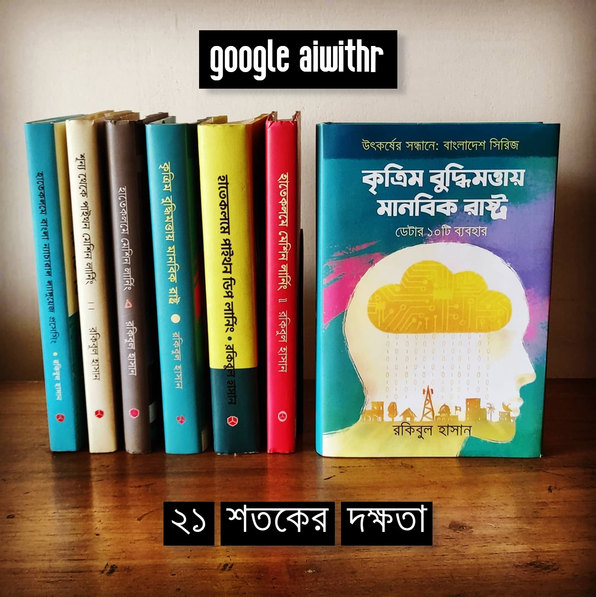



২০১০ সালে সরকারি একটা বিশাল প্রজেক্টে পরিসংখ্যান নিয়ে আমার হাতেখড়ি হয় এই রাস্তায়। মোবাইল এবং ল্যান্ডলাইনের কোটি কোটি মিনিটের ভয়েস কল এবং এসএমএস ইন্টারকানেকশন হোলসেল প্রাইসিং। প্রচুর ডকুমেন্টেশন এবং কিছু ট্রেনিং আমাকে বুঝিয়ে দেয় ডেটার ক্ষমতা। এর পাশাপাশি, ছোটবেলা থেকেই আমি অফিশিয়াল ডকুমেন্টেশনে বিশ্বাসী। যাকে আমরা বলি RTFM, ‘রিড দ্য ফাইন ম্যানুয়াল’ চলে আসছে সেই নিউজ গ্রুপের যুগ থেকে। ছোটবেলায় কমোডরের সঙ্গে আসা সেই ‘জি ডব্লিউ বেসিক’-এর সেই ম্যানুয়াল আমাকে দেখিয়েছিল কীভাবে অফিশিয়াল ডকুমেন্টেশন অসাধারণ হয়। সেকারনে ['সাইকিট-লার্ন'](https://scikit-learn.org/) এর ডকুমেন্টেশন নিয়ে পড়ে থাকা। আচ্ছা, যিনি একটা প্রোডাক্ট বানিয়েছেন, তার তৈরি ম্যানুয়াল ভালো হবে না আর কারটা হবে?
{: .notice}



<div class="badges">
	<span class="badge">আর প্রোগ্রামিং</span>
	<span class="badge info">পাইথন প্রোগ্রামিং</span>
	<span class="badge warning">পাইথন+আর প্রোগ্রামিং</span>
	<span class="badge danger">পাইথন ডিপ লার্নিং</span>
	<span class="badge success">ন্যাচারাল ল্যাঙ্গুয়েজ প্রসেসিং</span>
	<span class="badge info">নীতিনির্ধারণী</span>
</div>

## শুধুমাত্র মেশিন লার্নিং বইয়ের ক্রমধারা (সিরিজ আকারে)

মেশিন লার্নিং শুরু করতে গেলে বইগুলোর ক্রমধারা, ১ থেকে ৪।


<div class="badges">
	<span class="badge">আর প্রোগ্রামিং</span>
	<span class="badge info">পাইথন প্রোগ্রামিং</span>
	<span class="badge warning">পাইথন+আর প্রোগ্রামিং</span>
	<span class="badge danger">পাইথন ডিপ লার্নিং</span>
	<span class="badge success">ন্যাচারাল ল্যাঙ্গুয়েজ প্রসেসিং</span>
</div>

## বাংলায় ন্যাচারাল ল্যাঙ্গুয়েজ প্রসেসিংয়ের বই


<div class="badges">
	<span class="badge info">পাইথন প্রোগ্রামিং</span>
	<span class="badge danger">পাইথন ডিপ লার্নিং</span>
	<span class="badge success">ন্যাচারাল ল্যাঙ্গুয়েজ প্রসেসিং</span>
</div>

বাংলায় ন্যাচারাল ল্যাঙ্গুয়েজ প্রসেসিংয়ের বইটা পড়ার জন্য [**হাতেকলমে পাইথন ডিপ লার্নিং**](https://aiwithr.github.io/nlpbook/) বইটি হাতের কাছে থাকলে সুবিধা হবে।
{: .notice-info}

## এক নজরে সব অনলাইন/প্রিন্ট বই (লিংকসহ)

| ০৬টি বইয়ের নাম | অনলাইন লিংক | প্রিন্ট বই লিংক |
| :--- | :--- | :--- | :--- |
| হাতেকলমে মেশিন লার্নিং \(দ্বিতীয় সংস্করণ\) | [গিটবুক](https://rakibul-hassan.gitbook.io/mlbook-titanic/) | [রকমারি](https://rokomari.com/book/174186/) |
| দ্বিতীয় সংস্করনে যুক্ত করা পাইথন অংশ | [গিটবুক](https://rakibul-hassan.gitbook.io/mlbook-titanic/j_notebook/titanic-project-test) | [রকমারি](https://rokomari.com/book/174186/) |
| 'শূন্য থেকে পাইথন মেশিন লার্নিং' \(দ্বিতীয় সংস্করণ\) | [গিটবুক](https://raqueeb.gitbook.io/scikit-learn/) | [রকমারি](https://www.rokomari.com/book/187277/) |
| হাতেকলমে পাইথন ডিপ লার্নিং | [গিটবুক](https://rakibul-hassan.gitbook.io/deep-learning/) | [রকমারি](https://www.rokomari.com/book/198757/) |
| হাতেকলমে বাংলা ন্যাচারাল ল্যাঙ্গুয়েজ প্রসেসিং | [অনলাইন-বই](https://aiwithr.github.io/nlpbook/) | [রকমারি](https://www.rokomari.com/book/209335/) |
| কৃত্রিম বুদ্ধিমত্তায় মানবিক রাষ্ট্র (অনলাইন) | [অনলাইন](https://aiwithr.github.io/aibook/) | [ইন্টারফেস](https://raqueeb.github.io/excel/) |
| উৎকর্ষের সন্ধানে: বাংলাদেশ; কৃত্রিম বুদ্ধিমত্তায় মানবিক রাষ্ট্র | [অনলাইন-বই](https://aiwithr.github.io/aibook/) | [রকমারি](https://www.rokomari.com/book/215389/) |
| নন-প্রোগ্রামারদের জন্য ডেটা অ্যানালাইটিক্স | [ভিডিও](https://youtube.com/playlist?list=PL5NPSn95n_L4Z5bpCOqHW_QU8nxgywGM2) | [অনলাইন বই](https://aiwithr.github.io/analyst/) |
| পাঁচটা বই একসাথে কেনার লিঙ্ক | [এখানে](https://www.rokomari.com/book/218840/) | [রকমারি](https://www.rokomari.com/book/218840/) |
| নীলক্ষেত থেকে কেনার ব্যবস্থা | [প্রিন্ট বই, নীলক্ষেত, হক, মানিক লাইব্রেরি সহ অনেকে](https://www.facebook.com/%E0%A6%B9%E0%A6%95-%E0%A6%B2%E0%A6%BE%E0%A6%87%E0%A6%AC%E0%A7%8D%E0%A6%B0%E0%A7%87%E0%A6%B0%E0%A7%80-%E0%A6%A8%E0%A7%80%E0%A6%B2%E0%A6%95%E0%A7%8D%E0%A6%B7%E0%A7%87%E0%A6%A4%E0%A6%A2%E0%A6%BE%E0%A6%95%E0%A6%BE-996072720590097/)| [ফোন: ০১৭৩৫৭৪২৯০৮, ০১৮২০১৫৭১৮১](https://www.facebook.com/ManikLibraryOnline) |

## বাংলায় ডিপ লার্নিংয়ের বই


<div class="badges">
	<span class="badge info">পাইথন প্রোগ্রামিং</span>
	<span class="badge danger">পাইথন ডিপ লার্নিং</span>
	<span class="badge success">ন্যাচারাল ল্যাঙ্গুয়েজ প্রসেসিং</span>
</div>

## মেশিন লার্নিং বইগুলোর দারাজ এর লিংক

| বইয়ের নাম | দারাজ |
| :--- | :--- |
| হাতেকলমে মেশিন লার্নিং (২য় সংস্করণ) | [লিংক](https://www.daraz.com.bd/products/-i100277811-s1014173037.html) |
| শুন্য থেকে পাইথন মেশিন লার্নিং | [লিংক](https://www.daraz.com.bd/products/i124917119-s1045126110.html) |
| হাতেকলমে পাইথন ডিপ লার্নিং | [লিংক](https://www.daraz.com.bd/products/-i128958054-s1048760362.html) |
| হাতেকলমে বাংলা ন্যাচারাল ল্যাঙ্গুয়েজ প্রসেসিং | [লিংক](https://www.daraz.com.bd/products/by-i177138727-s1117054703.html) |
| কৃত্রিম বুদ্ধিমত্তায় মানবিক রাষ্ট্র | [আসবে](https://aiwithr.github.io/aibook/) |

## নতুন (নীতিনির্ধারণী বই) এর লিংক

* [কৃত্রিম বুদ্ধিমত্তা, আমাদের ভবিষ্যৎ: নীতিনির্ধারণী আলাপ - বাংলাদেশ](https://aiwithr.github.io/aibook/)
* [ওয়েব ইন্টারফেস](https://raqueeb.github.io/excel/)
* [উৎকর্ষের সন্ধানে: বাংলাদেশ; কৃত্রিম বুদ্ধিমত্তায় মানবিক রাষ্ট্র](https://www.rokomari.com/book/215389/)


<div class="badges">
	<span class="badge">খসড়া</span>
	<span class="badge info">নীতিনির্ধারণী</span>
	<span class="badge success">বাংলাদেশ</span>
</div>

## আমাজন কিন্ডেল এডিশন (গ্লোবাল মার্কেট)

* [হাতেকলমে মেশিন লার্নিং \(দ্বিতীয় সংস্করণ\)](https://www.amazon.com/dp/B089NTNG3R/)
* [শূন্য থেকে পাইথন মেশিন লার্নিং \(দ্বিতীয় সংস্করণ\)](https://www.amazon.com/dp/B089NWHC96/)
* [হাতেকলমে পাইথন ডিপ লার্নিং](https://www.amazon.com/gp/product/B08FGVM5DL)

## গুগল প্লে বুকস (গুগল বুকস, গ্লোবাল মার্কেট)

(বাংলাদেশের জন্য নয়)

* [হাতেকলমে মেশিন লার্নিং \(দ্বিতীয় সংস্করণ\)](https://play.google.com/store/books/details?id=7xbpDwAAQBAJ)
* [শূন্য থেকে পাইথন মেশিন লার্নিং \(দ্বিতীয় সংস্করণ\)](https://play.google.com/store/books/details?id=cFzeDwAAQBAJ)
* [হাতেকলমে পাইথন ডিপ লার্নিং](https://play.google.com/store/books/details?id=6xbeDwAAQBAJ)

## গিটবুক/অনলাইন/টেবিল অফ কনটেন্ট (পিডিএফ)

আমার খসড়া বইগুলো **সবসময়ই** ফ্রি থাকবে অনলাইনে \(গিটবুকে\)। অন্য ফরম্যাটের বইগুলো কিনতে হবে না এমুহুর্তে। পরে কিনতে পারেন। সব বইগুলো অনলাইনে আছে। 'আন-এডিটেড'। আসল বইগুলো বাজারে আসার আগেই পাবলিশিং হাউস প্রফেশনালি এডিট করে দিয়েছেন। বইগুলোর 'টেবিল অফ কনটেন্ট' অর্থাৎ সূচিপত্র ডাউনলোড হবে 'পিডিএফ' হিসেবে।
{: .notice-info}

| বইয়ের নাম | টেবিল অফ কনটেন্ট |
| :--- | :--- |
| [প্রথম গিটবুক, হাতেকলমে মেশিন লার্নিং](https://raqueeb.gitbooks.io/mlbook-titanic/content/) | [সূচী](https://github.com/aiwithr/aiwithr.github.io/raw/master/ai-policy-makers/ai-where-are-we.pdf) |
| [দ্বিতীয় গিটবুক, টাইটানিক -পাইথন অংশ](https://rakibul-hassan.gitbook.io/mlbook-titanic/j_notebook/titanic-project-test) | [সূচী](https://github.com/aiwithr/aiwithr.github.io/raw/master/ai-policy-makers/ai-where-are-we.pdf) |
| [তৃতীয় গিটবুক, শুন্য থেকে পাইথন মেশিন লার্নিং](https://raqueeb.gitbook.io/scikit-learn/) | [সূচী](https://github.com/aiwithr/aiwithr.github.io/raw/master/ai-policy-makers/what-is-ml.pdf) |
| [চতুর্থ গিটবুক, পাইথন ডিপ লার্নিং](https://www.rokomari.com/book/198757/) | [সূচী](https://github.com/aiwithr/aiwithr.github.io/raw/master/ai-policy-makers/concept-ai.pdf) |
| [পঞ্চম অনলাইন বুক, ন্যাচারাল ল্যাঙ্গুয়েজ প্রসেসিং](https://aiwithr.github.io/nlpbook/) | [সূচী](https://github.com/aiwithr/aiwithr.github.io/raw/master/ai-policy-makers/nlp-bangla.pdf) |
| [ষষ্ঠ অনলাইন বই, কৃত্রিম বুদ্ধিমত্তা, নীতিনির্ধারণী আলাপ - বাংলাদেশ](https://aiwithr.github.io/aibook/) | [সূচী](https://aiwithr.github.io/aibook/) |

## কোন বইয়ের পর কোন বইটা ব্যবহার করবো?

```bash
(মেশিন লার্নিং/এনএলপি বই)
১. ├── লাল বই = হাতেকলমে মেশিন লার্নিং (দ্বিতীয় সংস্করণ)
-. | অথবা
২. ├── কালো বই = বাজারে নেই, লাল বইয়ের প্রথম সংস্করণ হিসেবে ছিল
৩.     ├── সাদা-হলুদ বই = শূন্য থেকে পাইথন মেশিন লার্নিং                        
৪.         ├── সবুজ-হলুদ = হাতেকলমে পাইথন ডিপ লার্নিং       # অ্যাডভান্সড ব্যবহারকারীদের জন্য   
৫.            └── নীল-সাদা = হাতেকলমে বাংলা ন্যাচারাল ল্যাঙ্গুয়েজ প্রসেসিং   # যারা ল্যাঙ্গুয়েজ নিয়ে কাজ করতে চান
(ডেটা অ্যানালাইটিক্স বই)
৭. অনলাইনে আছে, প্রিন্ট আসছে সামনে
(নন-টেকনিক্যাল বই, সবার জন্য)
৮. ├── উৎকর্ষের সন্ধানে: বাংলাদেশ; কৃত্রিম বুদ্ধিমত্তায় মানবিক রাষ্ট্র
```


## ডেটা অ্যানালাইটিক্স নিয়ে বই

(১) কাল অথবা (২) লাল এবং (৩) হলুদ বই দিয়ে শুরু করা যায়। শুধুমাত্র [ডেটা অ্যানালাইটিক্স](https://aiwithr.github.io/analyst/) নিয়ে আসছে নতুন বই। 


## বইগুলোর ইউটিউব ভিডিও সিরিজ, প্লেলিস্ট

২০০+ ভিডিও, [এখানে](https://www.youtube.com/channel/UC4RrCd2anEWtZJr9_wX76kA)! একটা উদাহরণ দেখতে পারেন নিচে।

<iframe width="560" height="315" src="//www.youtube.com/embed/ABVFcHJvEps" frameborder="0"> </iframe>

| প্লেলিস্ট এর নাম | প্ল্যাটফর্ম |
| :--- | :--- |
| [নন-প্রোগ্রামারদের ডেটা অ্যানালাইটিক্স মেন্টরশীপ](https://youtube.com/playlist?list=PL5NPSn95n_L4Z5bpCOqHW_QU8nxgywGM2) | [ইউটিউব](https://youtube.com/playlist?list=PL5NPSn95n_L4Z5bpCOqHW_QU8nxgywGM2) |
| [সহজ বাংলায় 'বাংলা' ন্যাচারাল ল্যাঙ্গুয়েজ প্রসেসিং](https://www.youtube.com/playlist?list=PL5NPSn95n_L4sMoCygyX3cKkSOKdQA_BT) | [ইউটিউব](https://www.youtube.com/playlist?list=PL5NPSn95n_L4sMoCygyX3cKkSOKdQA_BT) |
| [মেশিন লার্নিং \(দ্বিতীয় সংস্করণ\) বইয়ের ভিডিও সিরিজ](https://www.youtube.com/playlist?list=PL5NPSn95n_L4AUOUjfZamspLzCAEeJW3p) | [ইউটিউব](https://www.youtube.com/playlist?list=PL5NPSn95n_L4AUOUjfZamspLzCAEeJW3p) |
| [শুন্য থেকে পাইথন মেশিন লার্নিং বই ভিডিও সিরিজ](https://www.youtube.com/playlist?list=PL5NPSn95n_L6otapZwZILRZ0016XSyKS7) | [ইউটিউব](https://www.youtube.com/playlist?list=PL5NPSn95n_L6otapZwZILRZ0016XSyKS7) |
| [রকিবের সাথে ডীপ লার্নিং, টেনসর ফ্লো](https://www.youtube.com/playlist?list=PL5NPSn95n_L7XouyUuSbNE-v3zxq5LxfV) | [ইউটিউব](https://www.youtube.com/playlist?list=PL5NPSn95n_L7XouyUuSbNE-v3zxq5LxfV) |
| [প্রথম নিউরাল নেটওয়ার্ক ট্রেনিং - টেনসর ফ্লো](https://www.youtube.com/playlist?list=PL5NPSn95n_L64yse4BRzRYFn5HTYw1Ewb) | [ইউটিউব](https://www.youtube.com/playlist?list=PL5NPSn95n_L64yse4BRzRYFn5HTYw1Ewb) |
| [রকিবের সাথে কৃত্রিম বুদ্ধিমত্তা: সামনের ৫ বছর](https://www.youtube.com/watch?v=39nFK52uE7I&list=PL5NPSn95n_L5UIuCYp0ZUAVB-DBkGh9pZ) | [ইউটিউব](https://www.youtube.com/watch?v=39nFK52uE7I&list=PL5NPSn95n_L5UIuCYp0ZUAVB-DBkGh9pZ) |
| [পাইথনে মেশিন লার্নিং](https://www.youtube.com/watch?v=s-BQnTcgaDs&list=PL5NPSn95n_L4_foe3F8iKwNn9Ovhtuikg) | [ইউটিউব](https://www.youtube.com/watch?v=s-BQnTcgaDs&list=PL5NPSn95n_L4_foe3F8iKwNn9Ovhtuikg) |
| [প্রথম নিউরাল নেটওয়ার্ক ট্রেনিং - টেনসর ফ্লো](https://www.youtube.com/watch?v=iL1OpDE0K6E&list=PL5NPSn95n_L4A4avTNLKeEZNZbVGhuHWF) | [ইউটিউব](https://www.youtube.com/watch?v=eeR85_wzM-o&list=PL5NPSn95n_L64yse4BRzRYFn5HTYw1Ewb) |
| [কনভল্যুশনাল নিউরাল নেটওয়ার্কস \(CNN](https://www.youtube.com/watch?v=iL1OpDE0K6E&list=PL5NPSn95n_L4A4avTNLKeEZNZbVGhuHWF)\) | [ইউটিউব](https://www.youtube.com/watch?v=iL1OpDE0K6E&list=PL5NPSn95n_L4A4avTNLKeEZNZbVGhuHWF) |
| [মেশিন লার্নিং: "আর" এনভায়রনমেন্ট](https://www.youtube.com/watch?v=4-eFCfksLi0&list=PL5NPSn95n_L7758jfVvrlmWuKiWR3VnlU) | [ইউটিউব](https://www.youtube.com/watch?v=4-eFCfksLi0&list=PL5NPSn95n_L7758jfVvrlmWuKiWR3VnlU) |
| [১ মিনিটে মেশিন লার্নিং](https://www.youtube.com/watch?v=1tK_BbHFr48&list=PL5NPSn95n_L5jOaUoLci1_b6jiB_RM7at) | [ইউটিউব](https://www.youtube.com/watch?v=1tK_BbHFr48&list=PL5NPSn95n_L5jOaUoLci1_b6jiB_RM7at) |

## ফেসবুক, প্লেলিস্ট আছে ভেতরে

২০০+ ভিডিও, [এখানে](https://www.facebook.com/mltraining/videos)।

## মেশিন লার্নিং বইগুলোর প্র্যাকটিস গিটহাব লিংক

| বইয়ের নাম | গিটহাব লিংক |
| :--- | :--- |
| হাতেকলমে মেশিন লার্নিং (১ম সংস্করণ) | [লিংক](https://github.com/raqueeb/mltraining) |
| হাতেকলমে মেশিন লার্নিং (২য় সংস্করণ) | [লিংক](https://github.com/raqueeb/mltraining) |
| হাতেকলমে মেশিন লার্নিং (২য় সংস্করণ, শুধুমাত্র পাইথন) | [লিংক](https://github.com/raqueeb/mltraining/blob/master/Python/titanic-project-test.ipynb) |
| শুন্য থেকে পাইথন মেশিন লার্নিং | [লিংক](https://github.com/raqueeb/ml-python) |
| হাতেকলমে পাইথন ডিপ লার্নিং | [লিংক](https://github.com/raqueeb/TensorFlow2) |
| হাতেকলমে বাংলা ন্যাচারাল ল্যাঙ্গুয়েজ প্রসেসিং | [লিংক](https://github.com/raqueeb/nlp_bangla) |
| নন-প্রোগ্রামারদের জন্য ডেটা অ্যানালাইটিক্স | [লিংক](https://github.com//raqueeb/analyst/) |

## কিছু অনলাইন ট্রেনিং ম্যাটেরিয়াল

১. [কৃত্রিম বুদ্ধিমত্তা সিরিজ ১: বেসিক মেশিন লার্নিং](https://aiwithr.github.io/courses/)

২. [কৃত্রিম বুদ্ধিমত্তা সিরিজ ২: নীতিনির্ধারণী ফ্রেমওয়ার্ক](https://aiwithr.github.io/ai-policy-makers/)

৩. [কৃত্রিম বুদ্ধিমত্তা সিরিজ ২: ডিপ লার্নিং ফ্রেমওয়ার্ক - টেন্সরফ্লো + পাইটর্চ]()

## রকিবের সাথে 'কৃত্রিম বুদ্ধিমত্তা' ওয়েবসাইট

বাংলাদেশ এবং আমাদের ভবিষ্যত - ইন্টারফেস [এখানে](https://raqueeb.github.io/excel/)।

## সমস্যায় পড়লে যোগাযোগ (বইগুলোর ক্ষেত্রে)

১. [হাজারো প্রশ্নের উত্তর](https://aiwithr.github.io/getting-started/)

২. আমাদের একটা অসাধারণ [ফেসবুক গ্রুপ](https://www.facebook.com/groups/173027520158292) আছে, যেখানে পোস্ট দিলেই অনেকে উত্তর দিয়ে থাকেন। এছাড়া ‘মেশিন লার্নিং’ ব্যাপারটা নিয়ে আমি ‘প্যাশনেট’ হলেও সেটা আমাকে করতে হয় অবসর সময়ে, কর্মক্ষেত্র এবং সংসারের বাইরে। তাই, আগে [প্রশ্নগুলোর উত্তর](https://aiwithr.github.io/getting-started/) দেখুন, তারপর কল করতে পারেন মেসেঞ্জার [Rakibul Hassan](http://m.me/raqueeb) এবং ০১৭১৩০৯৫৭৬৭ (বিকাল ৫- ৬টা) নম্বরে।

## অ্যামাজন অন ডিমান্ড প্রিন্ট

আসছে সামনে।
